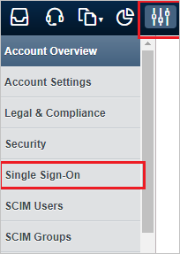
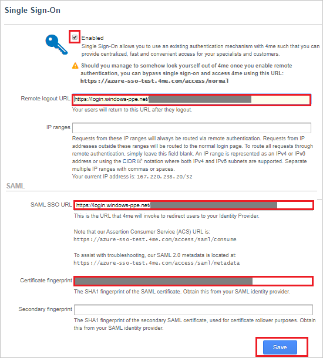

## Prerequisites

To configure Azure AD integration with 4me, you need the following items:

- An Azure AD subscription
- A 4me single sign-on enabled subscription

> **Note:**
> To test the steps in this tutorial, we do not recommend using a production environment.

To test the steps in this tutorial, you should follow these recommendations:

- Do not use your production environment, unless it is necessary.
- If you don't have an Azure AD trial environment, you can [get a one-month trial](https://azure.microsoft.com/pricing/free-trial/).

### Configuring 4me for single sign-on

1. In a different web browser window, login to 4me as an Administrator.

2. On the top left, click on **Settings** logo and on the left side bar click **Single Sign-On**.

    

3. On the **Single Sign-On** page, perform the following steps:

	

	a. Select the **Enabled** option.

	b. In the **Remote logout URL** textbox, paste the value of **Azure AD Sign Out URL** : %metadata:singleSignOutServiceUrl%, which you have copied from the Azure portal.

	c. Under **SAML** section, in the **SAML SSO URL** textbox, paste the value of **Azure AD Single Sign-On Service URL** : %metadata:singleSignOnServiceUrl%, which you have copied from the Azure portal.

	d. In the **Certificate fingerprint** textbox, paste the **THUMBPRINT** value seperated by a colon in duplets order (AA:BB:CC:DD:EE:FF:GG:HH:II), which you have copied from the Azure portal.

	e. Click **Save**.

## Quick Reference

* **Azure AD Single Sign-On Service URL** : %metadata:singleSignOnServiceUrl%

* **Azure AD Sign Out URL** : %metadata:singleSignOutServiceUrl%

* **Azure AD SAML Entity ID** : %metadata:IssuerUri%

* **[Download Azure AD Signing Certifcate (Base64 encoded)](%metadata:certificateDownloadBase64Url%)**

## Additional Resources

* [How to integrate 4me with Azure Active Directory](https://docs.microsoft.com/azure/active-directory/saas-apps/4me-tutorial)
