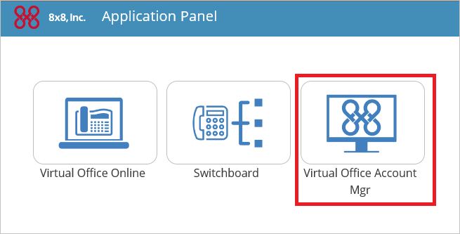
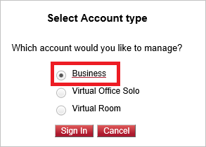

## Prerequisites

To configure Azure AD integration with 8x8 Virtual Office, you need the following items:

- An Azure AD subscription
- A 8x8 Virtual Office single-sign on enabled subscription

> **Note:**
> To test the steps in this tutorial, we do not recommend using a production environment.

To test the steps in this tutorial, you should follow these recommendations:

- You should not use your production environment, unless this is necessary.
- If you don't have an Azure AD trial environment, you can get an one-month trial [here](https://azure.microsoft.com/pricing/free-trial/).

### Configuring 8x8 Virtual Office for single sign-on

1. Sign-on to your 8x8 Virtual Office tenant as an administrator.

2. Select **Virtual Office Account Mgr** on Application Panel.
   
    

3. Select **Business** account to manage and click **Sign In** button.
   
    

4. Click **Accounts** tab in the menu list.
   
    

5. Click **Single Sign On** in the list of Accounts.
   
    

6. Select **Single Sign On** under Authentication method and click **SAML**.
    
    

7. Copy **Azure AD Single Sign-On Service URL** : %metadata:singleSignOnServiceUrl%,  **Azure AD Sign Out URL** : %metadata:singleSignOutServiceUrl% and **Azure AD SAML Entity ID** : %metadata:IssuerUri% from Azure AD to **Sign In URL**, **Sign Out URL** and **Issuer URL** in 8x8 Virtual Office. 
    
    
    
8. Click **Browser** button to upload the certificate which you downloaded from Azure AD, and click the **Save** button.

## Quick Reference

* **Azure AD Single Sign-On Service URL** : %metadata:singleSignOnServiceUrl%

* **Azure AD Sign Out URL** : %metadata:singleSignOutServiceUrl%

* **Azure AD SAML Entity ID** : %metadata:IssuerUri%

* **[Download Azure AD Signing Certifcate](%metadata:CertificateDownloadRawUrl%)**

## Additional Resources

* [How to integrate 8x8 Virtual Office with Azure Active Directory](https://docs.microsoft.com/azure/active-directory/active-directory-saas-8x8virtualoffice-tutorial)
