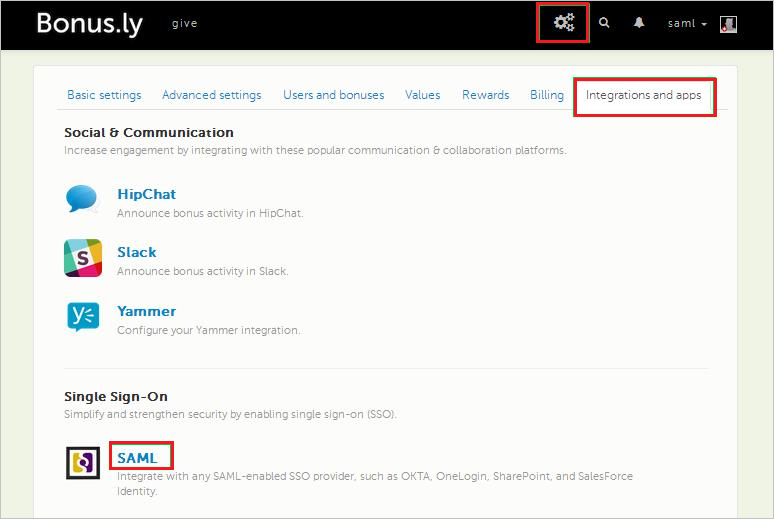
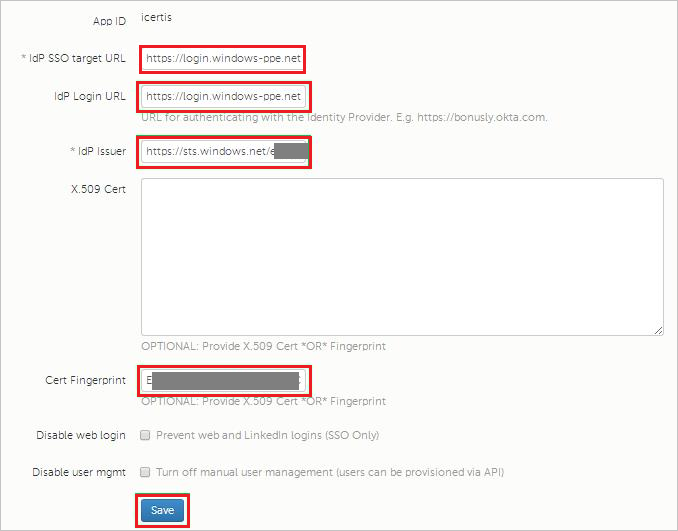

## Prerequisites

To configure Azure AD integration with Bonusly, you need the following items:

- An Azure AD subscription
- A Bonusly single sign-on enabled subscription

> **Note:**
> To test the steps in this tutorial, we do not recommend using a production environment.

To test the steps in this tutorial, you should follow these recommendations:

- Do not use your production environment, unless it is necessary.
- If you don't have an Azure AD trial environment, you can get a one-month trial [here](https://azure.microsoft.com/pricing/free-trial/).

### Configuring Bonusly for single sign-on

1. In a different browser window, log in to your **Bonusly** tenant.

2. In the toolbar on the top, click **Settings**, and then select **Integrations and apps**.
   
    

3. Under **Single Sign-On**, select **SAML**.

4. On the **SAML** dialog page, perform the following steps:
   
    
   
    a. In the **IdP SSO target URL** textbox, paste the value of **Azure AD Single Sign-On Service URL** : %metadata:singleSignOnServiceUrl%, which you have copied from Azure portal.
   
    b. In the **IdP Issuer** textbox, paste the value of **Azure AD SAML Entity ID** : %metadata:IssuerUri%, which you have copied from Azure portal. 

    c. In the **IdP Login URL** textbox, paste the value of **SAML Single Sign-On Service URL**, which you have copied from Azure portal.

    d. Paste the **Thumbprint** value copied from Azure portal into the **Cert Fingerprint** textbox.
   
5. Click **Save**.

## Quick Reference

* **Azure AD Single Sign-On Service URL** : %metadata:singleSignOnServiceUrl%

* **Azure AD SAML Entity ID** : %metadata:IssuerUri%

* **[Download Azure AD Signing Certifcate (Base64 encoded)](%metadata:certificateDownloadBase64Url%)**

## Additional Resources

* [How to integrate Bonus.ly with Azure Active Directory](https://docs.microsoft.com/azure/active-directory/active-directory-saas-bonus-tutorial)
