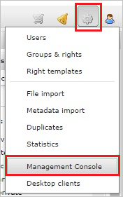
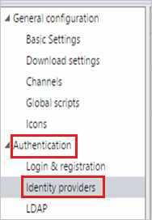
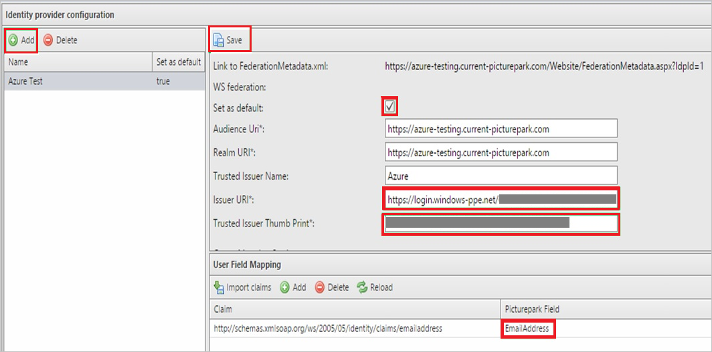
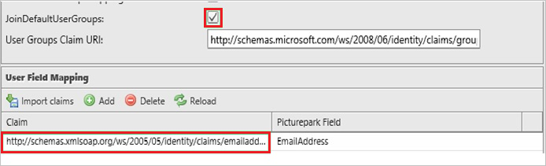

## Prerequisites

To configure Azure AD integration with Picturepark, you need the following items:

- An Azure AD subscription
- A Picturepark single sign-on enabled subscription

> **Note:**
> To test the steps in this tutorial, we do not recommend using a production environment.

To test the steps in this tutorial, you should follow these recommendations:

- Do not use your production environment, unless it is necessary.
- If you don't have an Azure AD trial environment, you can get a one-month trial [here](https://azure.microsoft.com/pricing/free-trial/).

### Configuring Picturepark for single sign-on

1. In a different web browser window, log into your Picturepark company site as an administrator.

2. In the toolbar on the top, click **Administrative tools**, and then click **Management Console**.
   
    

3. Click **Authentication**, and then click **Identity providers**.
   
    

4. In the **Identity provider configuration** section, perform the following steps:
   
    
   
    a. Click **Add**.
  
    b. Type a name for your configuration.
   
    c. Select **Set as default**.
   
    d. In **Issuer URI** textbox, paste the value of **Azure AD Single Sign-On Service URL** : %metadata:singleSignOnServiceUrl% which you have copied from Azure portal.
   
    e. In **Trusted Issuer Thumb Print** textbox, paste the value of **Thumbprint** which you have copied from **SAML Signing Certificate** section. 

5. Click **JoinDefaultUsersGroup**.

6. To set the **Emailaddress** attribute in the **Claim** textbox, type `http://schemas.xmlsoap.org/ws/2005/05/identity/claims/emailaddress` and click **Save**.

      

## Quick Reference

* **Azure AD Single Sign-On Service URL** : %metadata:singleSignOnServiceUrl%

## Additional Resources

* [How to integrate Picturepark with Azure Active Directory](https://docs.microsoft.com/azure/active-directory/active-directory-saas-picturepark-tutorial)
