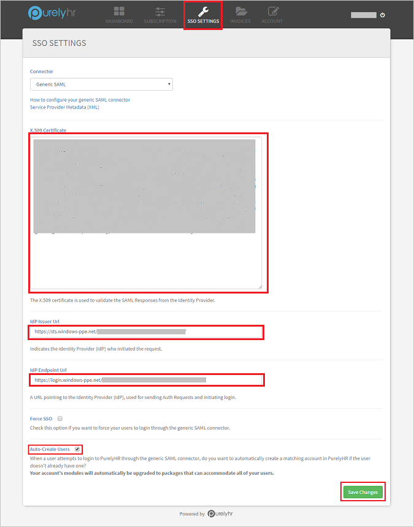

## Prerequisites

To configure Azure AD integration with PurelyHR, you need the following items:

- An Azure AD subscription
- A PurelyHR single-sign on enabled subscription

> [!Note]:
> To test the steps in this tutorial, we do not recommend using a production environment.

To test the steps in this tutorial, you should follow these recommendations:

- You should not use your production environment, unless this is necessary.
- If you don't have an Azure AD trial environment, you can get an one-month trial [here](https://azure.microsoft.com/pricing/free-trial/).

### Configuring PurelyHR for single sign-on

1. To configure single sign-on on **PurelyHR** side, login to their website as an administrator.

2. Open the **Dashboard** from the options in the toolbar and click **SSO Settings**.

3. Paste the values in the boxes as described below-

		

	a. Open the **Certificate(Bas64)**: (%metadata:certificateDownloadBase64Url%)** downloaded from the Azure portal in notepad and copy the certificate value. Paste the copied value into the **X.509 Certificate** box.

	b. In the **Idp Issuer URL** box, paste the **Azure AD SAML Entity ID** : %metadata:IssuerUri% copied from the Azure portal.

	c. In the **Idp Endpoint URL** box, paste the **Azure AD Single Sign-On Service URL** : %metadata:singleSignOnServiceUrl% copied from the Azure portal. 

	d. Check the **Auto-Create Users** checkbox to enable automatic user provisioning in PurelyHR.

	e. Click **Save Changes** to save the settings.

## Quick Reference

* **Azure AD Single Sign-On Service URL** : %metadata:singleSignOnServiceUrl%

* **Azure AD SAML Entity ID** : %metadata:IssuerUri%

* **[Download Azure AD Signing Certifcate (Base64 encoded)](%metadata:certificateDownloadBase64Url%)**

## Additional Resources

* [How to integrate Box with Azure Active Directory](active-directory-saas-box-tutorial.md)
* [How to configure user provisioning with Box](active-directory-saas-box-user-provisioning-tutorial.md)
