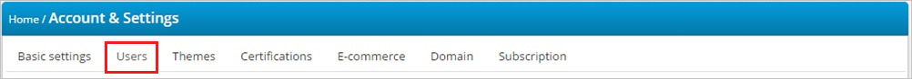
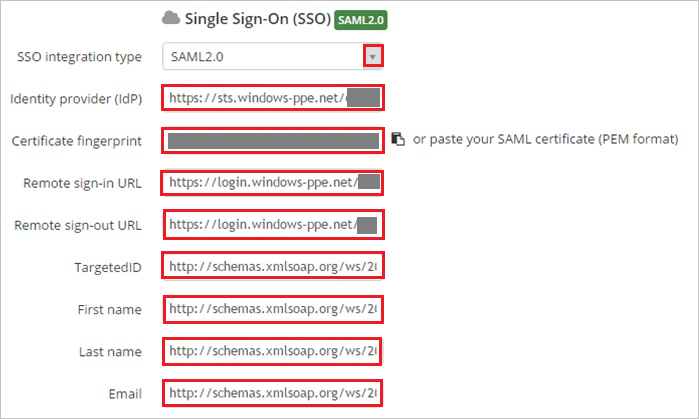

## Prerequisites

To configure Azure AD integration with TalentLMS, you need the following items:

- An Azure AD subscription
- A TalentLMS single sign-on enabled subscription

> **Note:**
> To test the steps in this tutorial, we do not recommend using a production environment.

To test the steps in this tutorial, you should follow these recommendations:

- Do not use your production environment, unless it is necessary.
- If you don't have an Azure AD trial environment, you can get a one-month trial [here](https://azure.microsoft.com/pricing/free-trial/).

### Configuring TalentLMS for single sign-on

1. In a different web browser window, log in to your TalentLMS company site as an administrator.

2. In the **Account & Settings** section, click the **Users** tab.
   
    

3. Click **Single Sign-On (SSO)**,

4. In the Single Sign-On section, perform the following steps:
   
       

    a. From the **SSO integration type** list, select **SAML 2.0**.

    b. In the **Identity provider (IDP)** textbox, paste the value of **Azure AD SAML Entity ID** : %metadata:IssuerUri%, which you have copied from Azure portal.
 
    c. Paste the **Thumbprint** value from Azure portal into the **Certificate fingerprint** textbox.    

    d.  In the **Remote sign-in URL** textbox, paste the value of **Azure AD Single Sign-On Service URL** : %metadata:singleSignOnServiceUrl%, which you have copied from Azure portal.
 
    e. In the **Remote sign-out URL** textbox, paste the value of **Azure AD Sign Out URL** : %metadata:singleSignOutServiceUrl%, which you have copied from Azure portal.

    f. Fill in the following: 

    * In the **TargetedID** textbox, type `http://schemas.xmlsoap.org/ws/2005/05/identity/claims/name`
     
    * In the **First name** textbox, type `http://schemas.xmlsoap.org/ws/2005/05/identity/claims/givenname`
    
    * In the **Last name** textbox, type `http://schemas.xmlsoap.org/ws/2005/05/identity/claims/surname`
    
    * In the **Email** textbox, type `http://schemas.xmlsoap.org/ws/2005/05/identity/claims/emailaddress`
    
5. Click **Save**.

## Quick Reference

* **Azure AD Single Sign-On Service URL** : %metadata:singleSignOnServiceUrl%

* **Azure AD Sign Out URL** : %metadata:singleSignOutServiceUrl%

* **Azure AD SAML Entity ID** : %metadata:IssuerUri%

* **[Download Azure AD Signing Certifcate (Base64 encoded)](%metadata:certificateDownloadBase64Url%)**

## Additional Resources

* [How to integrate TalentLMS with Azure Active Directory](https://docs.microsoft.com/azure/active-directory/active-directory-saas-talentlms-tutorial)
