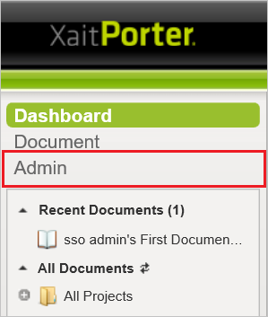
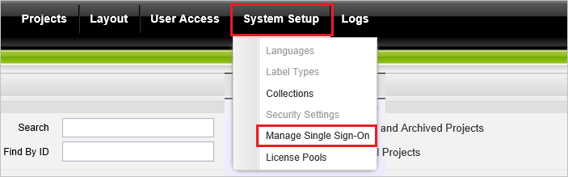
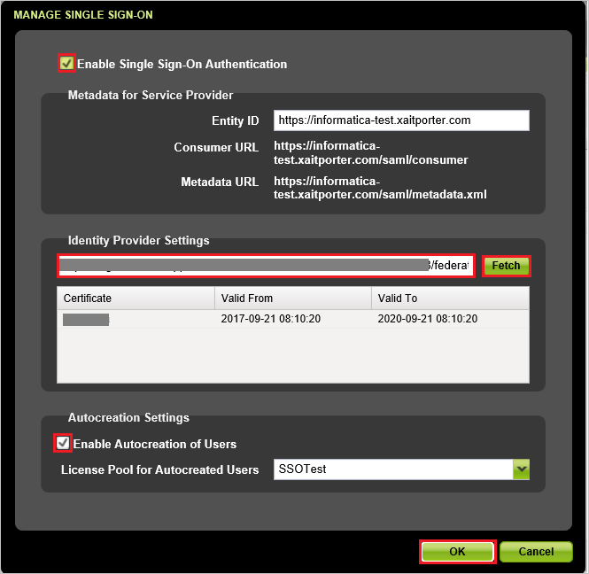

## Prerequisites

To configure Azure AD integration with XaitPorter, you need the following items:

- An Azure AD subscription
- A XaitPorter single sign-on enabled subscription

> **Note:**
> To test the steps in this tutorial, we do not recommend using a production environment.

To test the steps in this tutorial, you should follow these recommendations:

- Do not use your production environment, unless it is necessary.
- If you don't have an Azure AD trial environment, you can get a one-month trial [here](https://azure.microsoft.com/pricing/free-trial/).

### Configuring XaitPorter for single sign-on

1. In a different web browser window, log in to your XaitPorter company site as an administrator.

2. Click on **Admin**.

	

3. Select **Manage Single Sign-On** from the **System Setup** dropdown list.

	

4. In the **MANAGE SINGLE SIGN-ON** section, perform the following steps:

	

	a. Select **Enable Single Sign-On Authentication**.

	b. In **Identity Provider Settings** textbox, paste **Metadata URL** which you have copied from the Azure and click **Fetch**.

	c. Select **Enable Autocreation of Users**.

	d. Click **OK**.

## Quick Reference

* **[Download SAML Metadata file](%metadata:metadataDownloadUrl%)**

## Additional Resources

* [How to integrate XaitPorter with Azure Active Directory](https://docs.microsoft.com/azure/active-directory/active-directory-saas-xaitporter-tutorial)
