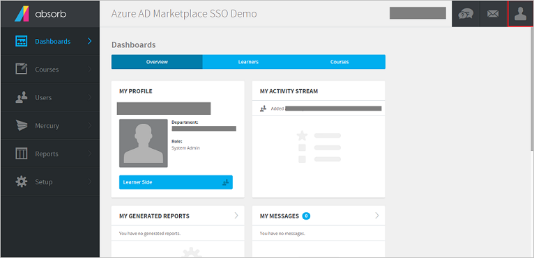
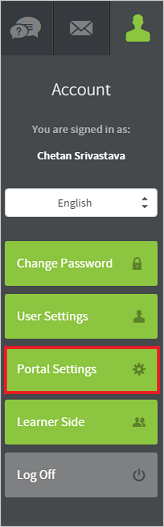
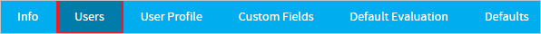
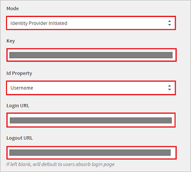
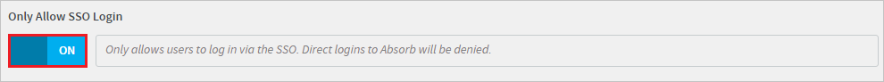

## Prerequisites

To configure Azure AD integration with Absorb LMS, you need the following items:

- An Azure AD subscription
- A Absorb LMS single-sign on enabled subscription

> **Note:**
> To test the steps in this tutorial, we do not recommend using a production environment.

To test the steps in this tutorial, you should follow these recommendations:

- Do not use your production environment, unless it is necessary.
- If you don't have an Azure AD trial environment, you can get a one-month trial [here](https://azure.microsoft.com/pricing/free-trial/).

### Configuring Absorb LMS for single sign-on

1. In a different web browser window, log in to your Absorb LMS company site as an administrator.

2. Click the **Account Icon** on the admin interface. 

	

3. Click **Portal Settings**.

	
	
4. Click the **Users** tab.

	

5. Perform the following steps to access the Single Sign-On configuration fields:

	

	a. Select the appropriate **Mode**.

	> **Note:**
	> Mode: Both IdP & SP initiated are supported.

	b. Open the metadata file that you have downloaded from the Azure portal in notepad, copy the certificate string which is located in the **ds:X509Certificate** tag and then paste the content in the **Key** textbox.
	
	c. In the **Id Property**, select the appropriate attribute, which you have configured as the user identifier in the Azure AD (For example, If the userprinciplename is selected in Azure AD, then Username would be selected here.)

	d. In the **Login URL**, enter **Azure AD Single Sign-On Service URL** : %metadata:singleSignOnServiceUrl%.

	e. In the **Logout URL**, enter **Azure AD Sign Out URL** : %metadata:singleSignOutServiceUrl%.

6. Enable **‘Only Allow SSO Login’**.

	

7. Click **"Save."**

## Quick Reference

* **Azure AD Single Sign-On Service URL** : %metadata:singleSignOnServiceUrl%

* **Azure AD Sign Out URL** : %metadata:singleSignOutServiceUrl%

* **[Download SAML Metadata file](%metadata:metadataDownloadUrl%)**

## Additional Resources

* [How to integrate Absorb LMS with Azure Active Directory](active-directory-saas-absorblms-tutorial.md)

