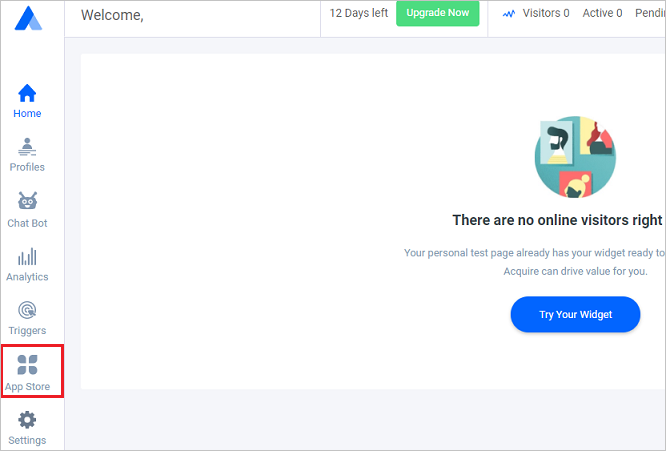
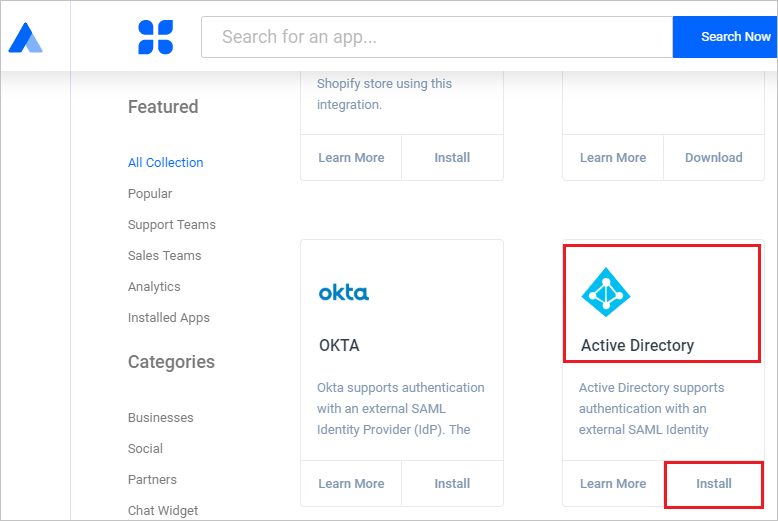
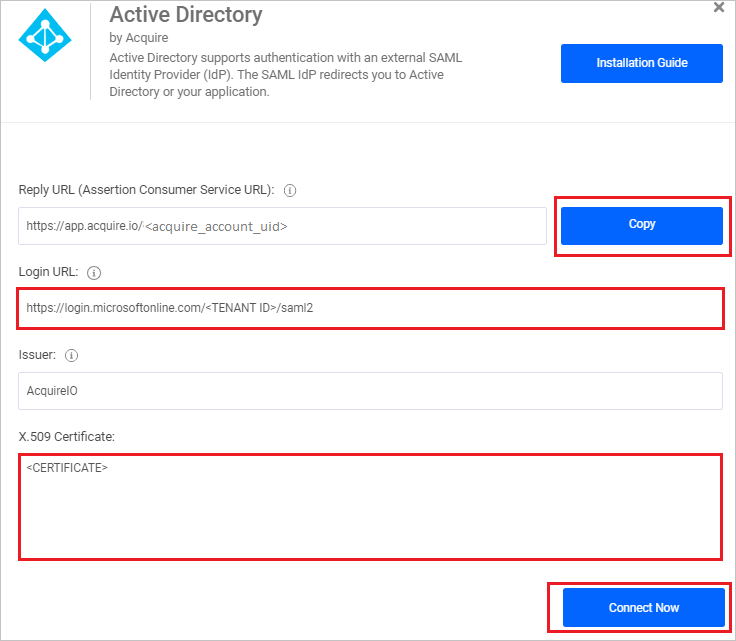

## Prerequisites

To configure Azure AD integration with AcquireIO, you need the following items:

- An Azure AD subscription
- An AcquireIO single sign-on enabled subscription

> **Note:**
> To test the steps in this tutorial, we do not recommend using a production environment.

To test the steps in this tutorial, you should follow these recommendations:

- Do not use your production environment, unless it is necessary.
- If you don't have an Azure AD trial environment, you can get a [free account](https://azure.microsoft.com/free/).

### Configuring AcquireIO for single sign-on

1. In a different web browser window, sign in to AcquireIO as an Administrator.

2. From the left side of menu, click on **App Store**.

	 

3. Scroll down upto **Active Directory** and click on **Install**.

    

4. On the Active Directory pop-up, perform the following steps:

    

	a. Click **Copy** to copy the Reply URL for your instance and paste it in **Reply URL** textbox in **Basic SAML Configuration** section on Azure portal.

    b. In the **Login URL** textbox, paste the value of **Login URL** : %metadata:singleSignOnServiceUrl%, which you have copied from Azure portal.

	c. Open the **[Downloaded Azure AD Signing Certifcate (Base64 encoded)](%metadata:certificateDownloadBase64Url%)** in Notepad, copy its content and paste it in the **X.509 Certificate** text box.

	d. Click **Connect Now**.

## Quick Reference

* **Login URL** : %metadata:singleSignOnServiceUrl%

* **Logout URL** : %metadata:singleSignOutServiceUrl%

* **Azure AD Idenitifier** : %metadata:IssuerUri%

* **[Download Azure AD Signing Certifcate (Base64 encoded)](%metadata:certificateDownloadBase64Url%)**

## Additional Resources

* [How to integrate AcquireIO with Azure Active Directory](https://docs.microsoft.com/azure/active-directory/saas-apps/acquireio-tutorial)
