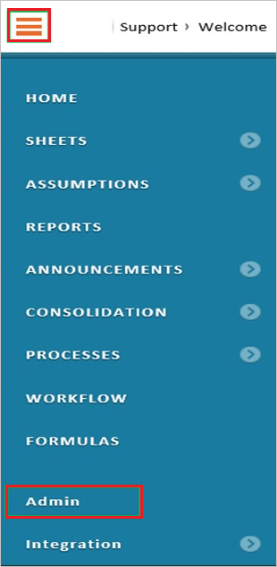

## Prerequisites

To configure Azure AD integration with Adaptive Suite, you need the following items:

- An Azure AD subscription
- An Adaptive Suite single sign-on enabled subscription

> **Note:**
> To test the steps in this tutorial, we do not recommend using a production environment.

To test the steps in this tutorial, you should follow these recommendations:

- Do not use your production environment, unless it is necessary.
- If you don't have an Azure AD trial environment, you can get an one-month trial [here](https://azure.microsoft.com/pricing/free-trial/).

### Configuring Adaptive Suite for single sign-on

1. In a different web browser window, log in to your Adaptive Suite company site as an administrator.

2. Go to **Admin**.
   
	

3. In the **Users and Roles** section, click **Manage SAML SSO Settings**.
   
	

4. On the **SAML SSO Settings** page, perform the following steps:
   
	

	a. In the **Identity provider name** textbox, type a name for your configuration.
	
	b. Paste the **Azure AD SAML Entity ID** : %metadata:IssuerUri% value copied from Azure portal into the **Identity provider Entity ID** textbox.
  
	c. Paste the **Azure AD Single Sign-On Service URL** : %metadata:singleSignOnServiceUrl% value copied from Azure portal into the **Identity provider SSO URL** textbox.
  
	d. Paste the **Azure AD Single Sign-On Service URL** : %metadata:singleSignOnServiceUrl% value copied from Azure portal into the **Custom logout URL** textbox.
  
	e. To upload your downloaded **[Azure AD Signing Certifcate (Base64 encoded)](%metadata:certificateDownloadBase64Url%)** , click **Choose file**.

    f. **SAML user id**, select **User’s Adaptive Insights user name**.

    g. **SAML user id location**, select **User id in NameID of Subject**.

    h. **SAML NameID format**, select **Email address**.

    i. **Enable SAML**, select **Allow SAML SSO and direct Adaptive Insights login**.
	
    j. Click **Save**.

## Quick Reference

* **Azure AD Single Sign-On Service URL** : %metadata:singleSignOnServiceUrl%

* **Azure AD SAML Entity ID** : %metadata:IssuerUri%

* **[Download Azure AD Signing Certifcate (Base64 encoded)](%metadata:certificateDownloadBase64Url%)**

## Additional Resources

* [How to integrate Adaptive Suite with Azure Active Directory](https://docs.microsoft.com/azure/active-directory/active-directory-saas-adaptive-suite-tutorial)
