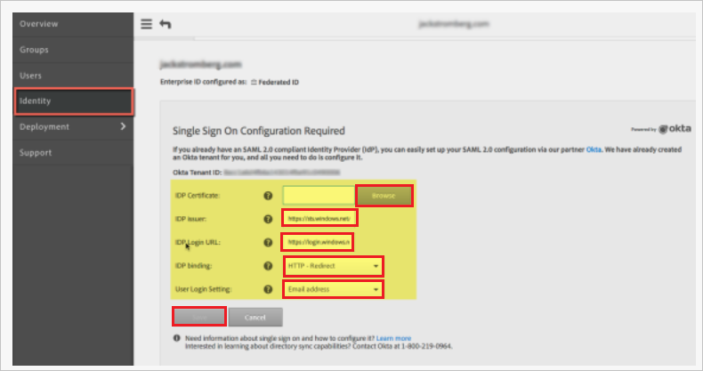
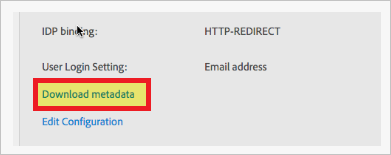
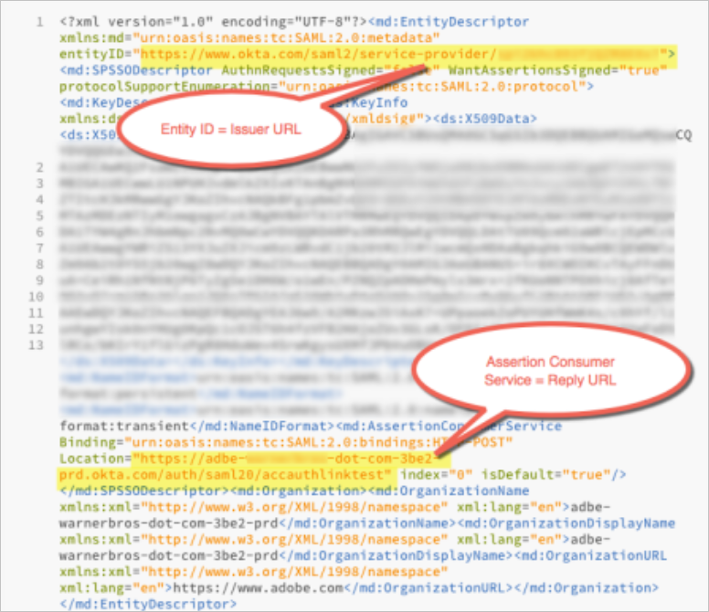

## Prerequisites

To configure Azure AD integration with Adobe Creative Cloud, you need the following items:

- An Azure AD subscription
- A Adobe Creative Cloud single sign-on enabled subscription

> **Note:**
> To test the steps in this tutorial, we do not recommend using a production environment.

To test the steps in this tutorial, you should follow these recommendations:

- Do not use your production environment, unless it is necessary.
- If you don't have an Azure AD trial environment, you can [get a one-month trial](https://azure.microsoft.com/pricing/free-trial/).

### Configuring Adobe Creative Cloud for single sign-on

1. In a different web browser window, sign-on to your Adobe Creative Cloud tenant as an administrator.

2. Go to **Identity** on the left navigation pane and click your domain. Then perform the following steps on **Single Sign On Configuration Required** section.

	
	
	a. Click **Browse** to upload the **[Downloaded Azure AD Signing Certifcate (Base64 encoded)](%metadata:certificateDownloadBase64Url%)** from Azure AD to **IDP Certificate**.
	
	b. In the **IDP issuer** textbox, put the value of **Azure AD SAML Entity ID** : %metadata:IssuerUri% which you copied from **Configure sign-on** section in Azure portal.
	
	c. In the **IDP Login URL** textbox, put the value of **Azure AD Single Sign-On Service URL** : %metadata:singleSignOnServiceUrl% which you copied from **Configure sign-on** section in Azure portal.
	
	d. Select **HTTP - Redirect** as **IDP Binding**.
	
	e. Select **Email Address** as **User Login Setting**.
	
	f. Click **Save** button.

3. The dashboard will now present the XML **"Download Metadata"** file. It contains Adobe’s EntityDescriptor URL and AssertionConsumerService URL. Please open the file and configure them in the Azure AD application.

	

	

	a. Use the EntityDescriptor value Adobe provided you for **Identifier** on the **Configure App Settings** dialog.

	b. Use the AssertionConsumerService value Adobe provided you for **Reply URL** on the **Configure App Settings** dialog.

## Quick Reference

* **Azure AD Single Sign-On Service URL** : %metadata:singleSignOnServiceUrl%

* **Azure AD Sign Out URL** : %metadata:singleSignOutServiceUrl%

* **Azure AD SAML Entity ID** : %metadata:IssuerUri%

* **[Download Azure AD Signing Certifcate (Base64 encoded)](%metadata:certificateDownloadBase64Url%)**

## Additional Resources

* [How to integrate Adobe Creative Cloud with Azure Active Directory](https://docs.microsoft.com/azure/active-directory/active-directory-saas-adobe-creative-cloud-tutorial)
