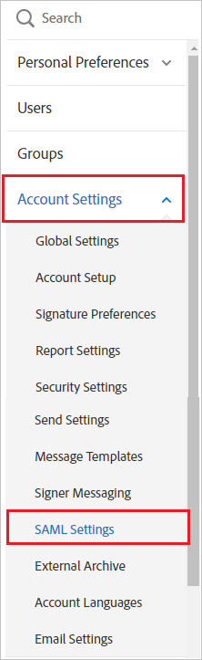
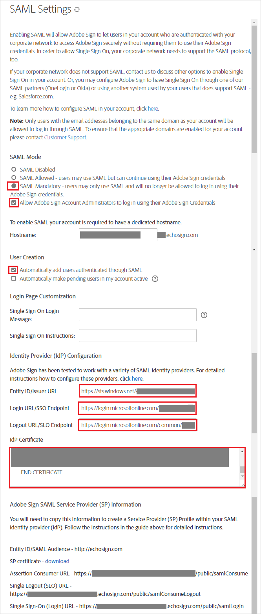

## Prerequisites

To configure Azure AD integration with Adobe Sign, you need the following items:

- An Azure AD subscription
- An Adobe Sign single sign-on enabled subscription

> **Note:**
> To test the steps in this tutorial, we do not recommend using a production environment.

To test the steps in this tutorial, you should follow these recommendations:

- Do not use your production environment, unless it is necessary.
- If you don't have an Azure AD trial environment, you can get a one-month trial [here](https://azure.microsoft.com/pricing/free-trial/).

### Configuring Adobe Sign for single sign-on

1. In a different web browser window, log in to your Adobe Sign company site as an administrator.

2. In the menu on the top, click **Account**, and then, in the navigation pane on the left die, click **SAML Settings** under **Account Settings**.
   
    

3. In the SAML Settings section, perform the following steps:
   
    
   
    a. As **SAML Mode**, select **SAML Mandatory**.
   
    b. Select **Allow EchoSign Account Administrators to log in using their EchoSign Credentials**.
   
    c. As **User Creation**, select **Automatically add users authenticated through SAML**.

4. Move on, performing the following steps:

    

    a. Paste **Azure AD SAML Entity ID** : %metadata:IssuerUri% into the **IdP Entity ID** textbox.
   	
	b. Paste **Azure AD Single Sign-On Service URL** : %metadata:singleSignOnServiceUrl% into the **IdP Login URL** textbox.
   
    c. Paste **Azure AD Sign Out URL** : %metadata:singleSignOutServiceUrl% into the **IdP Logout URL** textbox.

	d. Open your **[Download Azure AD Signing Certificate (Base64 encoded)](%metadata:certificateDownloadBase64Url%)** in notepad, copy the content of it into your clipboard, and then paste it to the **IdP Certificate** textbox

	e. Click **Save Changes**.

## Quick Reference

* **Azure AD Single Sign-On Service URL** : %metadata:singleSignOnServiceUrl%

* **Azure AD Sign Out URL** : %metadata:singleSignOutServiceUrl%

* **Azure AD SAML Entity ID** : %metadata:IssuerUri%

* **[Download Azure AD Signing Certificate (Base64 encoded)](%metadata:certificateDownloadBase64Url%)**

## Additional Resources

* [How to integrate Adobe Sign with Azure Active Directory](https://docs.microsoft.com/azure/active-directory/active-directory-saas-adobe-echosign-tutorial)
