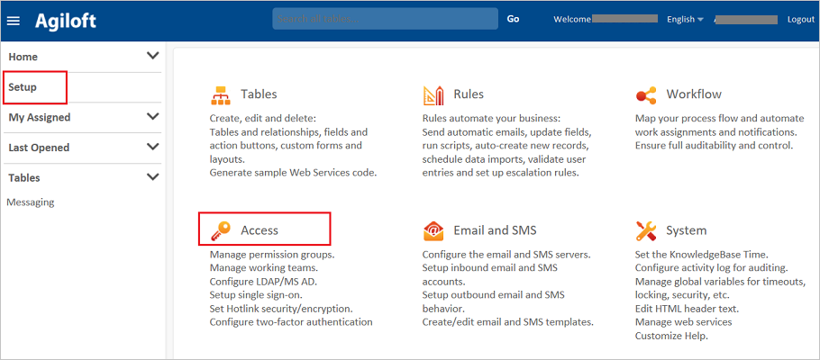
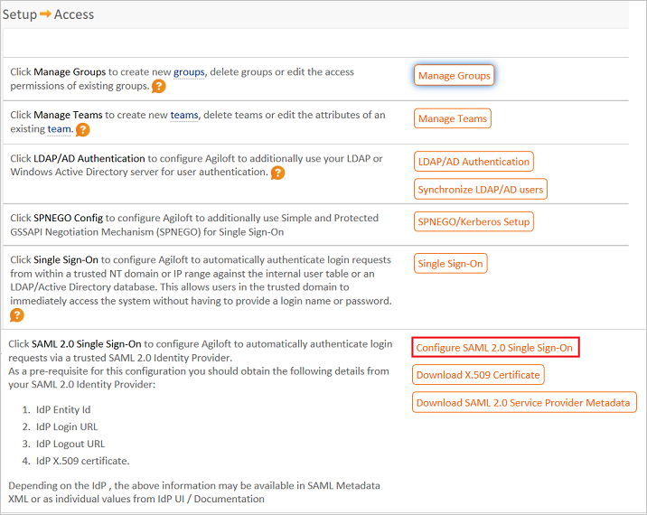
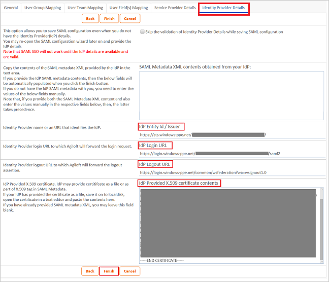

## Prerequisites

To configure Azure AD integration with Agiloft, you need the following items:

- An Azure AD subscription
- A Agiloft single sign-on enabled subscription

> **Note:**
> To test the steps in this tutorial, we do not recommend using a production environment.

To test the steps in this tutorial, you should follow these recommendations:

- Do not use your production environment, unless it is necessary.
- If you don't have an Azure AD trial environment, you can [get a one-month trial](https://azure.microsoft.com/pricing/free-trial/).

### Configuring Agiloft for single sign-on

1. In a different web browser window, log in to your Agiloft company site as an administrator.

2. Click on **Setup** (on the Left Pane) and then **Access**.

	 

3. Click on   the button **Configure SAML 2.0 Single Sign-On**. 
	
	 

4. A wizard dialog appears. On the dialog, click on the TAB  **Identity Provider Details** and fill in the following fields:  
	
	 

	a. In **IdP Entity Id / Issuer** textbox, paste the value of **Azure AD SAML Entity ID** : %metadata:IssuerUri%, which you have copied from Azure portal.

	b. In **IdP Login URL** textbox, paste the value of **Azure AD Single Sign-On Service URL** : %metadata:singleSignOnServiceUrl%*, which you have copied from Azure portal.

	c. In **IdP Logout URL** textbox, paste the value of **Azure AD Sign Out URL** : %metadata:singleSignOutServiceUrl%, which you have copied from Azure portal.

	d. Open your **[Downloaded Azure AD Signing Certifcate (Base64 encoded)](%metadata:certificateDownloadBase64Url%)** in notepad downloaded from Azure portal, copy the content of it into your clipboard, and then paste it to the **IdP Provided X.509 certificate contents** textbox.

	e. Click **Finish**.

## Quick Reference

* **Azure AD Single Sign-On Service URL** : %metadata:singleSignOnServiceUrl%

* **Azure AD Sign Out URL** : %metadata:singleSignOutServiceUrl%

* **Azure AD SAML Entity ID** : %metadata:IssuerUri%

* **[Download Azure AD Signing Certifcate (Base64 encoded)](%metadata:certificateDownloadBase64Url%)**

## Additional Resources

* [How to integrate Agiloft with Azure Active Directory](https://docs.microsoft.com/en-us/azure/active-directory/active-directory-saas-agiloft-tutorial)
