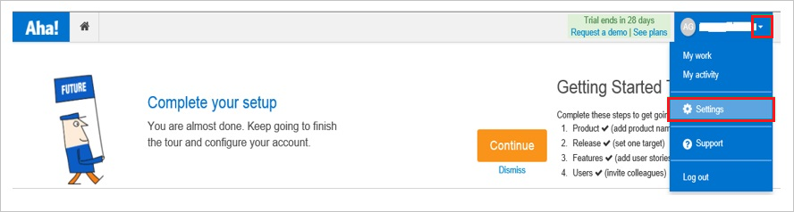
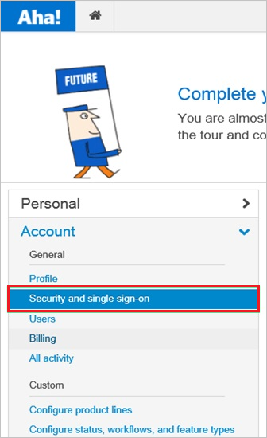

## Prerequisites

To configure Azure AD integration with Aha!, you need the following items:

- An Azure AD subscription
- An Aha! single sign-on enabled subscription

> **Note:**
> To test the steps in this tutorial, we do not recommend using a production environment.

To test the steps in this tutorial, you should follow these recommendations:

- Do not use your production environment, unless it is necessary.
- If you don't have an Azure AD trial environment, you can get a one-month trial [here](https://azure.microsoft.com/pricing/free-trial/).

### Configuring Aha! for single sign-on

1. In a different web browser window, log in to your Aha! company site as an administrator.

2. In the menu on the top, click **Settings**.

	

3. Click **Account**.
   
	

4. Click **Security and single sign-on**.
   
	

5. In **Single Sign-On** section, as **Identity Provider**, select **SAML2.0**.
   
	

6. On the **Single Sign-On** configuration page, perform the following steps:
    
	
	
	  a. In the **Name** textbox, type a name for your configuration.
	
	  b. For **Configure using**, select **Metadata File**.
   
      c. To upload your **[Downloaded SAML Metadata file](%metadata:metadataDownloadUrl%)**, click **Browse**.
   
      d. Click **Update**.

## Quick Reference

* **[Download SAML Metadata file](%metadata:metadataDownloadUrl%)**

## Additional Resources

* [How to integrate Aha! with Azure Active Directory](https://docs.microsoft.com/azure/active-directory/active-directory-saas-aha-tutorial)
