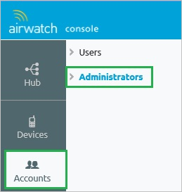
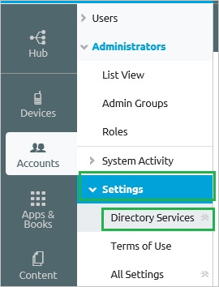
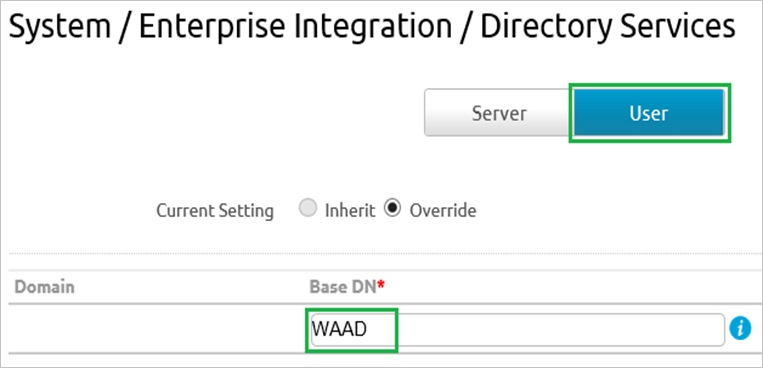
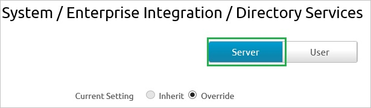
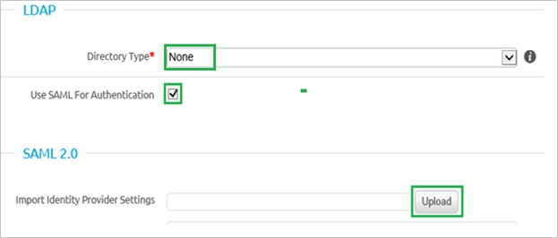
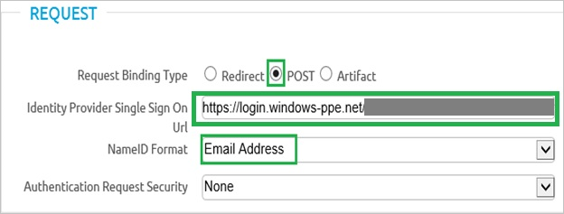

## Prerequisites

To configure Azure AD integration with AirWatch, you need the following items:

- An Azure AD subscription
- An AirWatch single-sign on enabled subscription

> [!NOTE:]
> To test the steps in this tutorial, we do not recommend using a production environment.

To test the steps in this tutorial, you should follow these recommendations:

- Do not use your production environment, unless it is necessary.
- If you don't have an Azure AD trial environment, you can get a one-month trial [here](https://azure.microsoft.com/pricing/free-trial/).

### Configuring AirWatch for single sign-on

1. In a different web browser window, log in to your AirWatch company site as an administrator.

2. In the left navigation pane, click **Accounts**, and then click **Administrators**.
   
   

3. Expand the **Settings** menu, and then click **Directory Services**.
   
   

4. Click the **User** tab, in the **Base DN** textbox, type your domain name, and then click **Save**.
   
   

5. Click the **Server** tab.
   
   

6. Perform the following steps:
    
	    

    a. As **Directory Type**, select **None**.

    b. Select **Use SAML For Authentication**.

    c. To upload the downloaded certificate, click **Upload**.

7. In the **Request** section, perform the following steps:
    
      

    a. As **Request Binding Type**, select **POST**.

    b. Type **Azure AD Single Sign-On Service URL**: %metadata:singleSignOnServiceUrl% in the **Identity Provider Single Sign On URL** textbox.

    c. As **NameID Format**, select **Email Address**.

    d. Click **Save**.

8. Click the **User** tab again.
    
    

9. In the **Attribute** section, perform the following steps:
    
    

    a. In the **Object Identifier** textbox, type **http://schemas.microsoft.com/identity/claims/objectidentifier**.

    b. In the **Username** textbox, type **http://schemas.xmlsoap.org/ws/2005/05/identity/claims/emailaddress**.

    c. In the **Display Name** textbox, type **http://schemas.xmlsoap.org/ws/2005/05/identity/claims/givenname**.

    d. In the **First Name** textbox, type **http://schemas.xmlsoap.org/ws/2005/05/identity/claims/givenname**.

    e. In the **Last Name** textbox, type **http://schemas.xmlsoap.org/ws/2005/05/identity/claims/surname**.

    f. In the **Email** textbox, type **http://schemas.xmlsoap.org/ws/2005/05/identity/claims/emailaddress**.
    
    g. Click **Save**.

## Quick Reference

* **Azure AD Single Sign-On Service URL** : %metadata:singleSignOnServiceUrl%

* **Azure AD SAML Entity ID** : %metadata:IssuerUri%

* **[Download SAML Metadata file](%metadata:metadataDownloadUrl%)**

## Additional Resources

* [How to integrate AirWatch with Azure Active Directory](active-directory-saas-Airwatch-tutorial.md)

