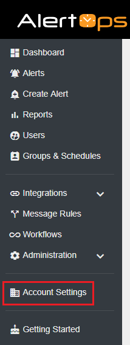
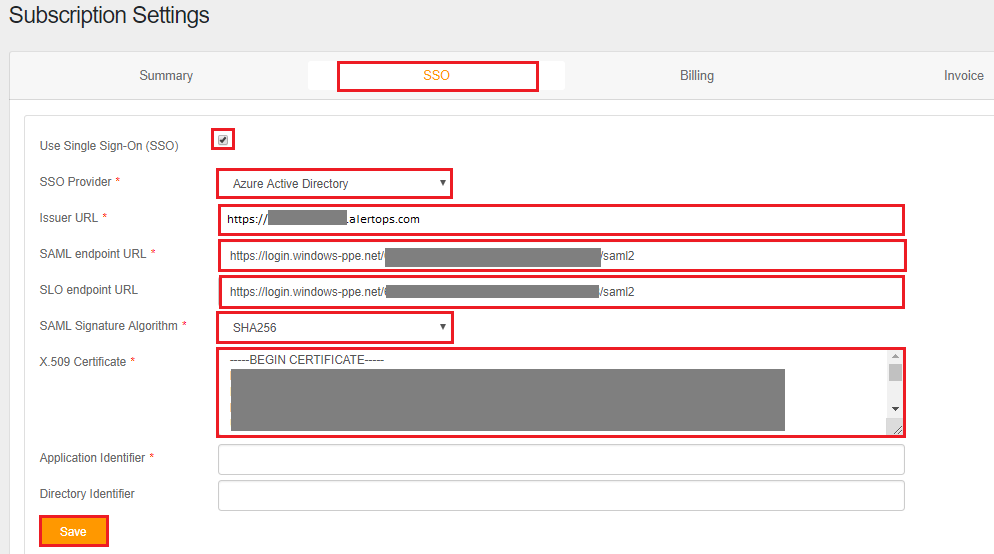

## Prerequisites

To configure Azure AD integration with AlertOps, you need the following items:

- An Azure AD subscription
- A AlertOps single sign-on enabled subscription

> **Note:**
> To test the steps in this tutorial, we do not recommend using a production environment.

To test the steps in this tutorial, you should follow these recommendations:

- Do not use your production environment, unless it is necessary.
- If you don't have an Azure AD trial environment, you can [get a one-month trial](https://azure.microsoft.com/pricing/free-trial/).

### Configuring AlertOps for single sign-on

1. In a different browser window, sign-on to your AlertOps company site as administrator.

2. Click on the **Account settings** from the left navigation panel.

    

3. On the **Subscription Settings** page select **SSO** and perform the following steps:

    

    a. Select **Use Single Sign-On(SSO)** checkbox.

    b. Select **Azure Active Directory** as a **SSO Provider** from the dropdown.

    c. In the **Issuer URL** textbox, use the identifier value which you have used in the **Basic SAML Configuration** section in the Azure portal.

    d. In the **SAML endpoint URL** textbox, paste the **Login URL** : %metadata:singleSignOnServiceUrl% value which you have copied from the Azure portal.

    e. In the **SLO endpoint URL** textbox, paste the **Login URL** : %metadata:singleSignOnServiceUrl% value which you have copied from the Azure portal.

    f. Select **SHA256** as a **SAML Signature Algorithm** from the dropdown.

    g. Open your **[Downloaded Azure AD Signing Certifcate (Base64 encoded)](%metadata:certificateDownloadBase64Url%)** file in Notepad. Copy the content of it into your clipboard, and then paste it to the X.509 Certificate text box.

## Quick Reference

* **Azure AD Single Sign-On Service URL** : %metadata:singleSignOnServiceUrl%

* **[Download Azure AD Signing Certifcate (Base64 encoded)](%metadata:certificateDownloadBase64Url%)**

## Additional Resources

* [How to integrate AlertOps with Azure Active Directory](https://docs.microsoft.com/azure/active-directory/saas-apps/alertops-tutorial)
