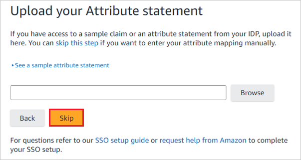
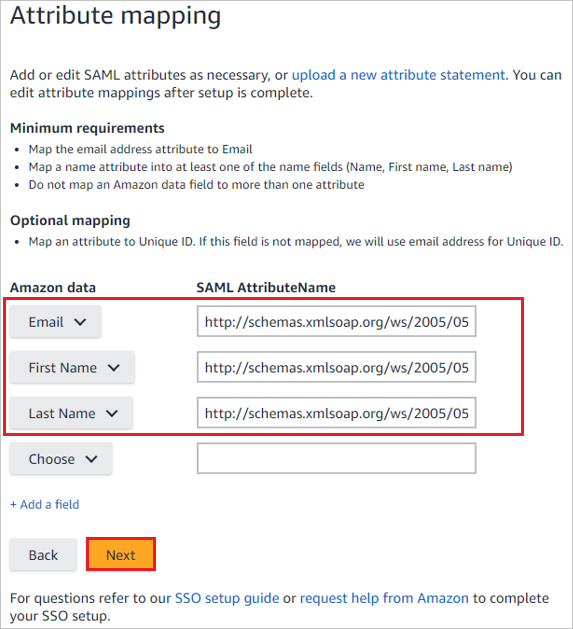
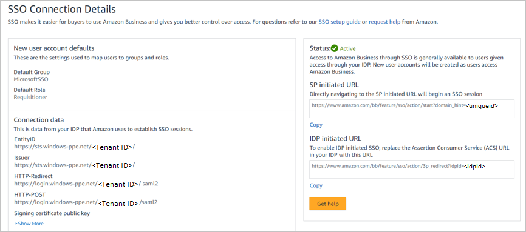

## Prerequisites

To configure Azure AD integration with Amazon Business, you need the following items:

- An Azure AD subscription
- A Amazon Business single sign-on enabled subscription

> **Note:**
> To test the steps in this tutorial, we do not recommend using a production environment.

To test the steps in this tutorial, you should follow these recommendations:

- Do not use your production environment, unless it is necessary.
- If you don't have an Azure AD trial environment, you can get a [free account](https://azure.microsoft.com/free/).

### Configuring Amazon Business for single sign-on

1. In a different web browser window, sign in to your Amazon Business company site as an administrator.

1. Click on the **User Profile** and select **Business Settings**.

	

1. On the **System integrations** wizard, select **Single Sign-On (SSO)**.

	

1. On the **Set up SSO** wizard, select the provider according to your Organizational requirements and click **Next**.

	

1. On the **New user account defaults** wizard, select the **Default Group** and then select **Default Buying Role** according to user role in your Organization and click **Next**.

	

1. On the **Upload your metadata file** wizard, click **Browse** to upload the **[Downloaded SAML Metadata file](%metadata:metadataDownloadUrl%)** from the Azure portal and click **Upload**.

	

1. After uploading the downloaded metadata file, the fields in the **Connection data** section will populate automatically. After that click **Next**.

	

1. On the **Upload your Attribute statement** wizard, click **Skip**.

	

1. On the **Attribute mapping** wizard, add the requirement fields by clicking the **+ Add a field** option. Add the attribute values including the namespace, which you have copied from the **User Attributes & Claims** section of Azure portal into the  **SAML AttributeName** field, and click **Next**.

	

1. On the **Amazon connection data** wizard, click **Next**.

	

1. Please check the **Status** of the steps which have been configured and click **Start testing**.

	

1. On the **Test SSO Connection** wizard, click **Test**.

	

1. On the **IDP initiated URL** wizard, before you click **Activate**, copy the value which is assigned to **idpid** and paste into the **idpid** parameter in the **Reply URL** in the **Basic SAML Configuration** section in the Azure portal.

	

1. On the **Are you ready to switch to active  SSO?** wizard, check **I have fully tested SSO and am ready to go live** checkbox and click on **Switch to active**.

	

1. Finally in the **SSO Connection details** section the **Status** is shown as **Active**.

	

## Quick Reference

* **Login URL** : %metadata:singleSignOnServiceUrl%

* **[Download Azure AD Signing Certifcate](%metadata:CertificateDownloadRawUrl%)**

* **[Download SAML Metadata file](%metadata:metadataDownloadUrl%)**

## Additional Resources

* [How to integrate Amazon Business with Azure Active Directory](https://docs.microsoft.com/azure/active-directory/saas-apps/amazon-business-tutorial)
