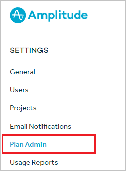

## Prerequisites

To configure Azure AD integration with Amplitude, you need the following items:

- An Azure AD subscription
- A Amplitude single sign-on enabled subscription

> **Note:**
> To test the steps in this tutorial, we do not recommend using a production environment.

To test the steps in this tutorial, you should follow these recommendations:

- Do not use your production environment, unless it is necessary.
- If you don't have an Azure AD trial environment, you can [get a one-month trial](https://azure.microsoft.com/pricing/free-trial/).

### Configuring Amplitude for single sign-on

1. Sign-on to your Amplitude company site as administrator.

2. Click on the **Plan Admin** from the left navigation bar.

	

3. Select **Microsoft Azure Active Directory Metadata** from the **SSO Integration**.

	

4. On the **Set Up Single Sign-On** section, perform the following steps:

	

	a. Open the **[Downloaded SAML Metadata file](%metadata:metadataDownloadUrl%)** from Azure portal in notepad, paste the content into the **Microsoft Azure Active Directory Metadata** textbox.

	b. Copy the **Reply URL (ACS)** value and paste it into the **Reply URL** textbox of Amplitude Domain and URLs section in the Azure portal.

	c. Click **Save**

## Quick Reference

* **[Download SAML Metadata file](%metadata:metadataDownloadUrl%)**

## Additional Resources

* [How to integrate Amplitude with Azure Active Directory](https://docs.microsoft.com/en-us/azure/active-directory/active-directory-saas-amplitude-tutorial)
