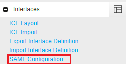
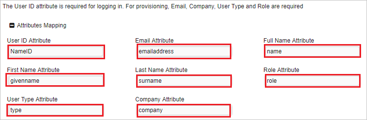

## Prerequisites

To configure Azure AD integration with Andromeda, you need the following items:

- An Azure AD subscription
- An Andromeda single sign-on enabled subscription

> **Note:**
> To test the steps in this tutorial, we do not recommend using a production environment.

To test the steps in this tutorial, you should follow these recommendations:

- Do not use your production environment, unless it is necessary.
- If you don't have an Azure AD trial environment, you can [get a one-month trial](https://azure.microsoft.com/pricing/free-trial/).

### Configuring Andromeda for single sign-on

1. Sign-on to your Andromeda company site as administrator.

2. On the top of the menubar click **Admin** and navigate to **Administration**.

	

3. On the left side of tool bar under **Interfaces** section, click **SAML Configuration**.

	

4. On the **SAML Configuration** section page, perform the following steps:

	

	a. Check **Enable SSO with SAML**.

	b. Under **Andromeda Information** section, copy the **SP Identity** value and paste it into the **Identifier** textbox of **Andromeda Domain and URLs** section.

	c. Copy the **Consumer URL** value and paste it into the **Reply URL** textbox of **Andromeda Domain and URLs** section.

	d. Copy the **Logon URL** value and paste it into the **Sign-on URL** textbox of **Andromeda Domain and URLs** section.

	e. Under **SAML Identity Provider** section, type your IDP Name.

	f. In the **Single Sign On End Point** textbox, paste the value of **Azure AD Single Sign-On Service URL** : %metadata:singleSignOnServiceUrl% which, you have copied from the Azure portal.

	g. Open the **[Downloaded Azure AD Signing Certifcate (Base64 encoded)](%metadata:certificateDownloadBase64Url%)** from Azure portal in notepad, paste it into the **X 509 Certificate** textbox.
	
	h. Map the following attributes with the respective value to facilitate SSO login from Azure AD. The **User ID** attribute is required for logging in. For provisioning, **Email**, **Company**, **UserType**, and **Role** are required. In this section, we define attributes mapping (name and values) which correlate to those defined within Azure portal

	

	i. Click **Save**.

## Quick Reference

* **Azure AD Single Sign-On Service URL** : %metadata:singleSignOnServiceUrl%

* **[Download Azure AD Signing Certifcate (Base64 encoded)](%metadata:certificateDownloadBase64Url%)**

## Additional Resources

* [How to integrate Andromeda with Azure Active Directory](https://docs.microsoft.com/azure/active-directory/active-directory-saas-andromedascm-tutorial)
