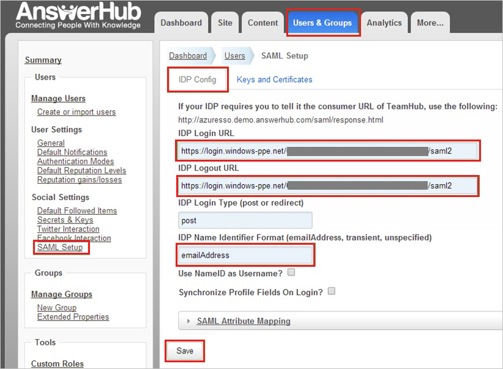
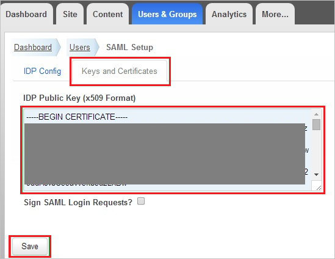

## Prerequisites

To configure Azure AD integration with AnswerHub, you need the following items:

- An Azure AD subscription
- An AnswerHub single sign-on enabled subscription

> **Note:**
> To test the steps in this tutorial, we do not recommend using a production environment.

To test the steps in this tutorial, you should follow these recommendations:

- Do not use your production environment, unless it is necessary.
- If you don't have an Azure AD trial environment, you can get a one-month trial [here](https://azure.microsoft.com/pricing/free-trial/).

### Configuring AnswerHub for single sign-on

1. In a different web browser window, log into your AnswerHub company site as an administrator.
   
    >**Note:**
    >If you need help configuring AnswerHub, contact [AnswerHub's support team](mailto:success@answerhub.com.).
   
2. Go to **Administration**.

3. Click the **User and Group** tab.

4. In the navigation pane on the left side, in the **Social Settings** section, click **SAML Setup**.

5. Click **IDP Config** tab.

6. On the **IDP Config** tab, perform the following steps:

       
  
     a. In **IDP Login URL** textbox, enter **Azure AD Single Sign-On Service URL** : %metadata:singleSignOnServiceUrl%.
  
     b. In **IDP Logout URL** textbox, enter **Azure AD Sign Out URL** : %metadata:singleSignOutServiceUrl%.
	 
     c. In **IDP Name Identifier Format** textbox, enter the user Identifier value same as selected in Azure portal in **User Attributes** section.
  
     d. Click **Keys and Certificates**.

7. On the Keys and Certificates tab, perform the following steps:
    
       
 
     a. Open your [base-64 encoded certificate](%metadata:certificateDownloadBase64Url%) which you have downloaded from Azure portal in notepad, copy the content of it into your clipboard, and then paste it to the **IDP Public Key (x509 Format)** textbox.
  
     b. Click **Save**.

8. On the **IDP Config** tab, click **Save**.

## Quick Reference

* **Azure AD Single Sign-On Service URL** : %metadata:singleSignOnServiceUrl%

* **Azure AD Sign Out URL** : %metadata:singleSignOutServiceUrl%

* **[Download Azure AD Signing Certifcate (Base64 encoded)](%metadata:certificateDownloadBase64Url%)**

## Additional Resources

* [How to integrate AnswerHub with Azure Active Directory](https://docs.microsoft.com/azure/active-directory/active-directory-saas-answerhub-tutorial)
