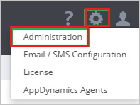
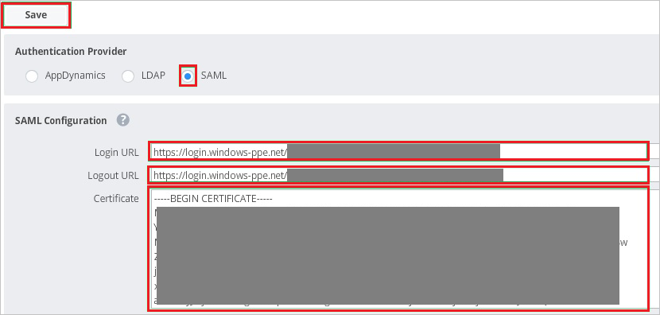
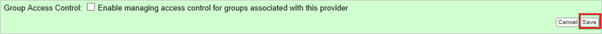

## Prerequisites

To configure Azure AD integration with AppDynamics, you need the following items:

- An Azure AD subscription
- A AppDynamics single-sign on enabled subscription

> **Note:**
> To test the steps in this tutorial, we do not recommend using a production environment.

To test the steps in this tutorial, you should follow these recommendations:

- You should not use your production environment, unless this is necessary.
- If you don't have an Azure AD trial environment, you can get an one-month trial [here](https://azure.microsoft.com/pricing/free-trial/).

### Configuring AppDynamics for single sign-on

1. In a different web browser window, log in to your AppDynamics company site as an administrator.

2. In the toolbar on the top, click **Settings**, and then click **Administration**.
   
    

3. Click the **Authentication Provider** tab.
   
    

4. In the **Authentication Provider** section, perform the following steps:
   
       

    a. As **Authentication Provider**, select **SAML**.

    b. Paste the **Azure AD Single Sign-On Service URL** : %metadata:singleSignOnServiceUrl% value into the **Login URL** textbox which you have copied from the Azure portal.

    c. Paste the **Azure AD Sign Out URL** : %metadata:singleSignOutServiceUrl% value into the **Logout URL** textbox which you have copied from the Azure portal.
       
    d. Open your [base-64 encoded certificate](%metadata:certificateDownloadBase64Url%) in notepad, copy the content of it into your clipboard, and then paste it to the **Certificate** textbox

    e. Click **Save**.

     

## Quick Reference

* **Azure AD Single Sign-On Service URL** : %metadata:singleSignOnServiceUrl%

* **Azure AD Sign Out URL** : %metadata:singleSignOutServiceUrl%

* **[Download Azure AD Signing Certifcate (Base64 encoded)](%metadata:certificateDownloadBase64Url%)**

## Additional Resources

* [How to integrate AppDynamics with Azure Active Directory](https://docs.microsoft.com/azure/active-directory/active-directory-saas-appdynamics-tutorial)
