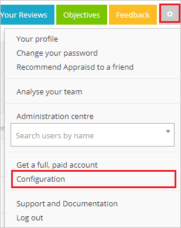
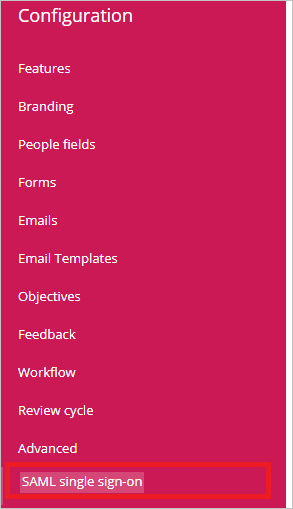
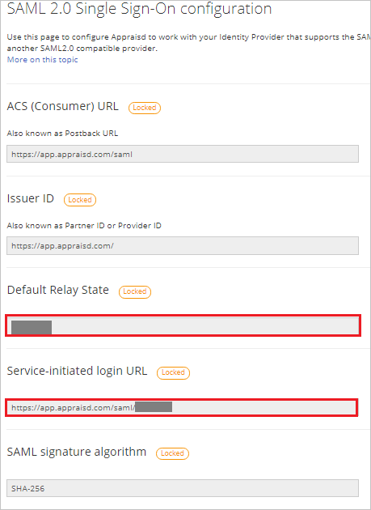
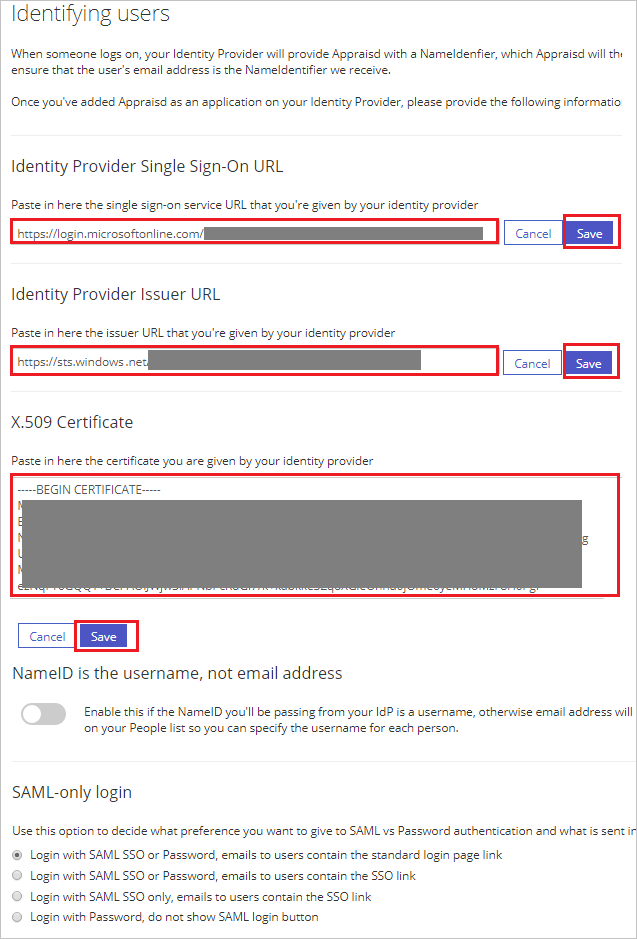

## Prerequisites

To configure Azure AD integration with Appraisd, you need the following items:

- An Azure AD subscription
- An Appraisd single sign-on enabled subscription

> **Note:**
> To test the steps in this tutorial, we do not recommend using a production environment.

To test the steps in this tutorial, you should follow these recommendations:

- Do not use your production environment, unless it is necessary.
- If you don't have an Azure AD trial environment, you can [get a one-month trial](https://azure.microsoft.com/pricing/free-trial/).

### Configuring Appraisd for single sign-on

1. In a different web browser window, sign in to Appraisd as a Security Administrator.

2. On the top right of the page, click on **Settings** icon, then navigate to **Configuration**.

	

3. From the Left side of menu, click on **SAML single sign-on**.

	

4. On the **SAML 2.0 Single Sign-On configuration** page, perform the following steps:
	
	

	a. Copy the **Default Relay State** value and paste it in **Relay State** textbox in **Basic SAML Configuration** on Azure portal.

	b. Copy the **Service-initiated login URL** value and paste it in **Sign-on URL** textbox in **Basic SAML Configuration** on Azure portal.

5. Scroll down the same page under **Identifying users**, perform the following steps:

	

	a. In the **Identity Provider Single Sign-On URL** textbox, paste the value of **Login URL** : %metadata:singleSignOnServiceUrl%, which you have copied from the Azure portal and click **Save**.

	b. In the **Identity Provider Issuer URL** textbox, paste the value of **Azure AD Identifier** : %metadata:IssuerUri%, which you have copied from the Azure portal and click **Save**.

	c. In Notepad, open the **[Downloaded Azure AD Signing Certifcate (Base64 encoded)](%metadata:certificateDownloadBase64Url%)** that you downloaded from the Azure portal, copy its content, and then paste it into the **X.509 Certificate** box and click **Save**.

## Quick Reference

* **Azure AD Single Sign-On Service URL** : %metadata:singleSignOnServiceUrl%

* **Azure AD Sign Out URL** : %metadata:singleSignOutServiceUrl%

* **Azure AD SAML Entity ID** : %metadata:IssuerUri%

* **[Download Azure AD Signing Certifcate (Base64 encoded)](%metadata:certificateDownloadBase64Url%)**

## Additional Resources

* [How to integrate Appraisd with Azure Active Directory](https://docs.microsoft.com/azure/active-directory/saas-apps/appraisd-tutorial)
