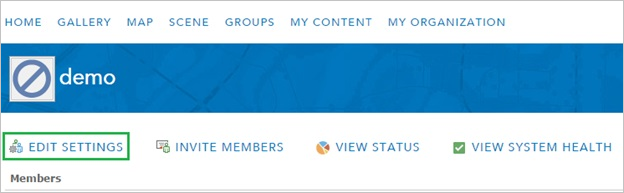
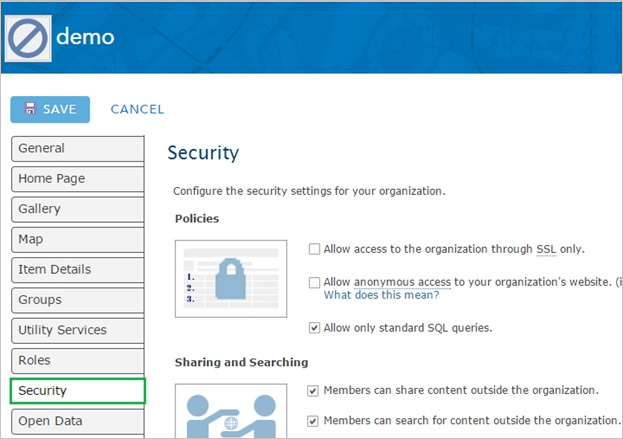
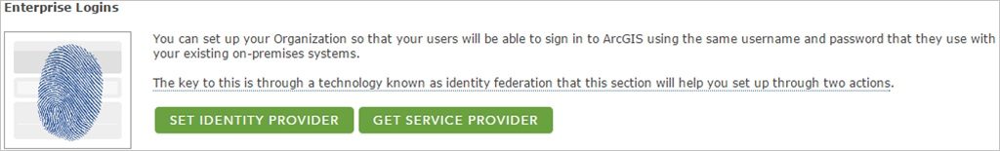
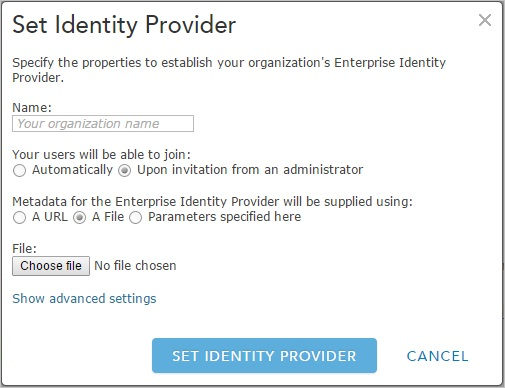

## Prerequisites

To configure Azure AD integration with ArcGIS Online, you need the following items:

- An Azure AD subscription
- A ArcGIS Online single-sign on enabled subscription

> **Note:**
> To test the steps in this tutorial, we do not recommend using a production environment.

To test the steps in this tutorial, you should follow these recommendations:

- Do not use your production environment, unless it is necessary.
- If you don't have an Azure AD trial environment, you can get a one-month trial [here](https://azure.microsoft.com/pricing/free-trial/).

### Configuring ArcGIS Online for single sign-on

1. In a different web browser window, log into your ArcGIS company site as an administrator.

2. Click **Edit Settings**.
      

3. Click **Security**.
     

4. Under **Enterprise Logins**, click **Set Identity Provider**.
    

5. On the **Set Identity Provider** configuration page, perform the following steps:
   
    
   
    a. In the Name textbox, type your organization’s name.

    b. For **Metadata for the Enterprise Identity Provider will be supplied using**, select **A File**.

    c. To upload your downloaded metadata file, click **Choose file**.

    d. Click **Set Identity Provider**.

## Quick Reference

* **Azure AD Single Sign-On Service URL** : %metadata:singleSignOnServiceUrl%

* **Azure AD Sign Out URL** : %metadata:singleSignOutServiceUrl%

* **[Download SAML Metadata file](%metadata:metadataDownloadUrl%)**

## Additional Resources

* [How to integrate Absorb ArcGis Online with Azure Active Directory](active-directory-saas-arcgisonline-tutorial.md)

