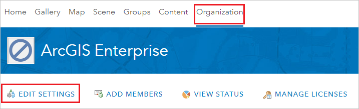
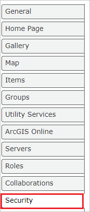
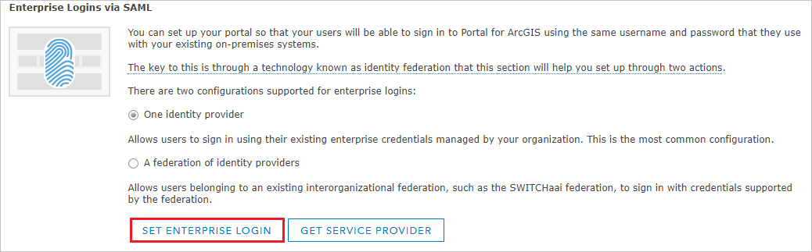
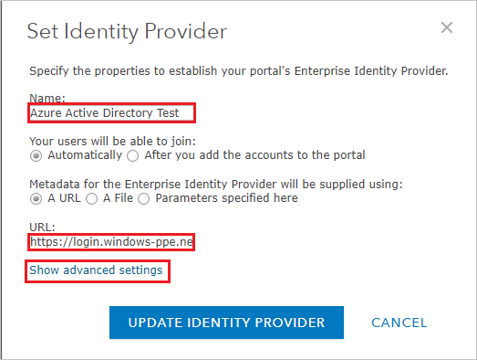
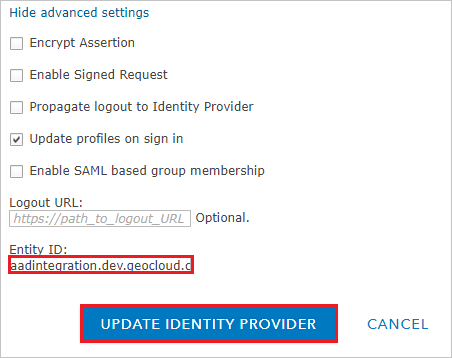

## Prerequisites

To configure Azure AD integration with ArcGIS Enterprise, you need the following items:

- An Azure AD subscription
- A ArcGIS Enterprise single sign-on enabled subscription

> **Note:**
> To test the steps in this tutorial, we do not recommend using a production environment.

To test the steps in this tutorial, you should follow these recommendations:

- Do not use your production environment, unless it is necessary.
- If you don't have an Azure AD trial environment, you can [get a one-month trial](https://azure.microsoft.com/pricing/free-trial/).

### Configuring ArcGIS Enterprise for single sign-on

1. In a different web browser window, log in to your ArcGIS Enterprise company site as an administrator.

2. Select **Organization >EDIT SETTINGS**.

	

3. Select **Security** tab.

	

4. Scroll down to the **Enterprise Logins via SAML** section and select **SET ENTERPRISE LOGIN**.

	

5. On the **Set Identity Provider** section, perform the following steps:

	

	a. Please provide a name like **Azure Active Directory Test** in the **Name** textbox.

	b. In the **URL** textbox, paste the **App Federation Metadata Url** value which you have copied from the Azure portal.

	c. Click **Show advanced settings** and copy the **Entity ID** value and paste it into the **Identifier** textbox in the **ArcGIS Enterprise Domain and URLs** section in Azure portal.

	

	d. Click **UPDATE IDENTITY PROVIDER**.

## Quick Reference

* **[Download Azure AD Signing Certifcate](%metadata:CertificateDownloadRawUrl%)**

* **[Download SAML Metadata file](%metadata:metadataDownloadUrl%)**

## Additional Resources

* [How to integrate ArcGIS Enterprise with Azure Active Directory](https://docs.microsoft.com/azure/active-directory/saas-apps/arcgisenterprise-tutorial)
