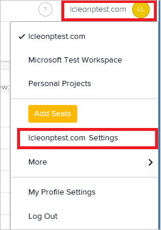
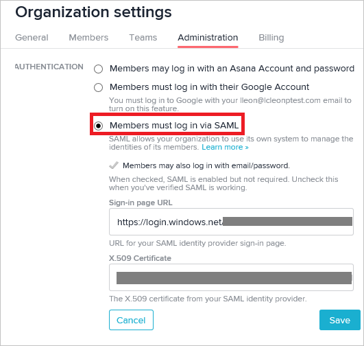

## Prerequisites

To configure Azure AD integration with Asana, you need the following items:

- An Azure AD subscription
- A Asana single-sign on enabled subscription

> **Note:**
> To test the steps in this tutorial, we do not recommend using a production environment.

To test the steps in this tutorial, you should follow these recommendations:

- You should not use your production environment, unless this is necessary.
- If you don't have an Azure AD trial environment, you can get an one-month trial [here](https://azure.microsoft.com/pricing/free-trial/).

### Configuring Asana for single sign-on

1. In a different browser window, sign-on to your Asana application. To configure SSO in Asana, access the workspace settings by clicking the workspace name on the top right corner of the screen. Then, click on **\<your workspace name\> Settings**. 
   
    

2. Right click the [certificate](%metadata:certificateDownloadBase64Url%) downloaded from Azure portal, then open the certificate file using Notepad or you preferred text editor. Copy the content between the begin and the end certificate title. This is the X.509 certificate you will use in Asana to configure SSO.

3. On the **Organization settings** window, click **Administration**. Then, click **Members must log in via SAML** to enable the SSO configuration. The perform the following steps:
   
      

     a. In the **Sign-in page URL** textbox, paste the **Azure AD Single Sign-On Service URL** : %metadata:singleSignOnServiceUrl%.

     b. In the **X.509 Certificate** textbox, paste the X.509 Certificate you have copied from Azure portal.

4. Click **Save**. Go to [Asana guide for setting up SSO](https://asana.com/guide/help/premium/authentication#gl-saml) if you need further assistance.

## Quick Reference

* **Azure AD Single Sign-On Service URL** : %metadata:singleSignOnServiceUrl%

* **[Download Azure AD Signing Certifcate (Base64 encoded)](%metadata:certificateDownloadBase64Url%)**

## Additional Resources

* [How to integrate Asana with Azure Active Directory](active-directory-saas-asana-tutorial.md)
