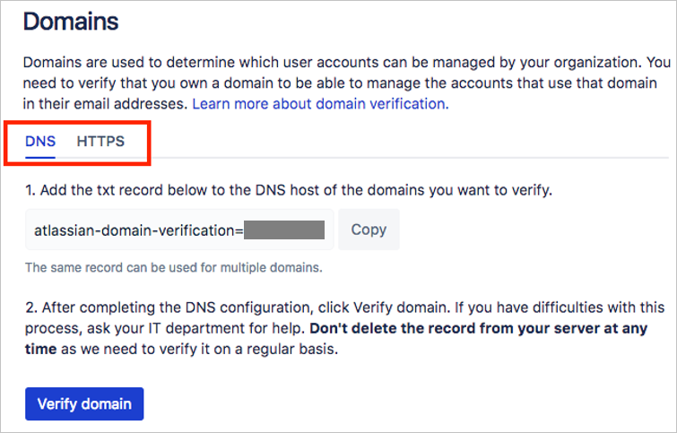
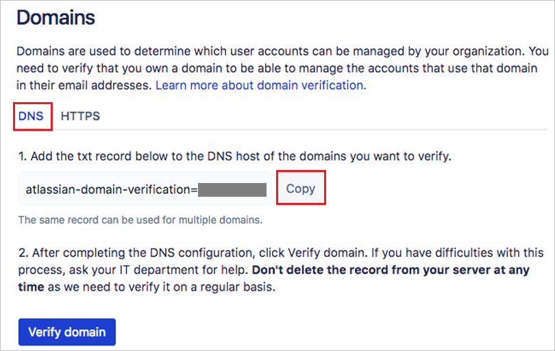
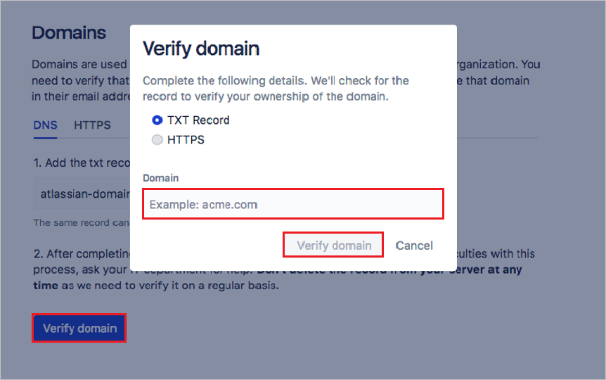
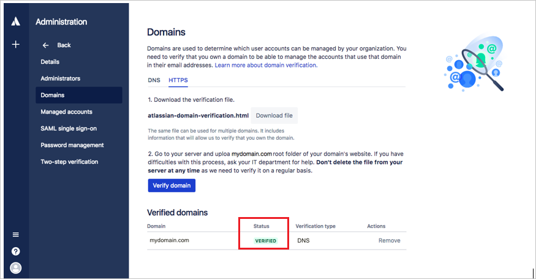
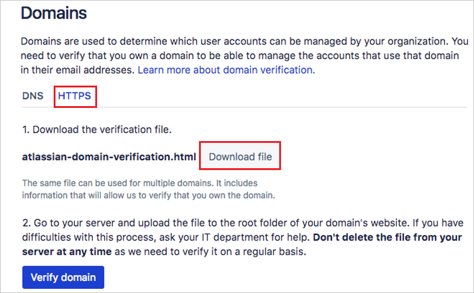
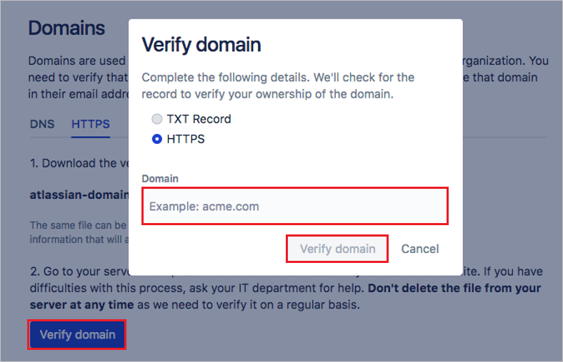
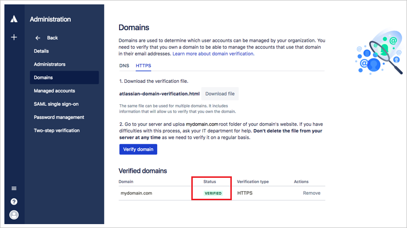

## Prerequisites

To configure Azure AD integration with Atlassian Cloud, you need the following items:

- An Azure AD subscription
- A Atlassian Cloud single sign-on enabled subscription

> **Note:**
> To test the steps in this tutorial, we do not recommend using a production environment.

To test the steps in this tutorial, you should follow these recommendations:

- Do not use your production environment, unless it is necessary.
- If you don't have an Azure AD trial environment, you can [get a one-month trial](https://azure.microsoft.com/pricing/free-trial/).

### Configuring Atlassian Cloud for single sign-on

1. To get SSO configured for your application, login to the Atlassian Portal using the administrator rights.

2. Navigate to **Atlassian Site Administration** > **Organizations & Security**. If you haven't already, create and name your organization. Then in the left navigattion, click **Domains**.

	

3. Select the way that you want to verify your domain - **DNS** or **HTTPS**.

	

4. For DNS verification, select **DNS** tab on the **Domains** page and perform follwing steps:

	

	a. Click **Copy** to copy the value for your TXT record.

	b. From your DNS, find the settings page for adding a new record

	c. Select the option for adding a new record and paste the value you copied from the **Domains** page to the **Value** field. Your DNS may also refer to it as **Answer** or **Description**.

	d. Your DNS record may also include the following fields:
	
	* **Record type**: Enter **TXT**
	* **Name/Host/Alias**: Leave the default (@ or blank)
	* **Time to live (TTL)**: Enter **86400**
	
	e.	Save the record.

5. Return to the **Domains page** in organization administration, and click the **Verify domain** button. Enter your domain name in the pop-up and click the **Verify domain** button.

		

	> **Note:**
	> It can take up to 72 hours for the TXT record changes to take effect, you won't know right away whether your domain verification was successful. Check your **Domains** page soon after you perform these steps for your verification status. You see following screen with updated status as **VERIFIED**.

	

6.	For HTTPS verification, select the **HTTPS** tab on the **Domains** page and perform following steps:

	

	a.	Click **Download file** to download the HTML file.

	b.	Upload the HTML file to the root directory of your domain.

7. Return to the **Domains** page in organization administration, and click the **Verify domain** button. Enter your **domain name** in the pop-up and click the **Verify domain** button.

	

8. If the verification process can locate the file you uploaded at the root directory, the status of the domain updates to **Verified**.

	

	> **Note:**
	> For more information refer [Atlassian's domain verification documentation](https://confluence.atlassian.com/cloud/domain-verification-873871234.html)

9. In the left navigation bar, click **SAML single sign-on**. If you haven't already, subscribe to Atlassian's Identity Manager.

	

10. In **Add SAML configuration** dialogue box add the Identity provider settings as follows:

	

	a. In the **Identity provider Entity ID** text box, paste the value of  **Azure AD SAML Entity ID** : %metadata:IssuerUri% which you have copied from Azure portal.

    b. In the **Identity provider SSO URL** text box, paste the value of **Azure AD Single Sign-On Service URL** : %metadata:singleSignOnServiceUrl% which you have copied from Azure portal.

    c. Open the **[Downloaded Azure AD Signing Certifcate (Base64 encoded)](%metadata:certificateDownloadBase64Url%)** from Azure portal and copy the values without the Begin and End lines and paste it in the **Public X509 certificate** box.
    
    d. Click **Save Configuration**  to save the settings.
     
11. Update the Azure AD settings to make sure that you have setup the correct URLs.
  
    

	> **Note:**
	> For exsting users, they need to update the **SP Identity ID** and **SP Assertion Consumer Service URL** values. For new user, they copy the both values and no need to update the values. 

	a. Copy the **SP Identity ID** from the SAML screen and paste the value in the **Identifier** box in the Azure portal, under Atlassian Cloud **Domain and URLs** section.
	
	b. Copy the **SP Assertion Consumer Service URL** from the SAML screen and paste the value in the **Reply URL** box in the Azure portal, under Atlassian Cloud **Domain and URLs** section.
	
	c. Sign On URL is the tenant URL of your Atlassian Cloud. 
	
12. In the Azure portal, Click **Save** button.

	

## Quick Reference

* **Azure AD Single Sign-On Service URL** : %metadata:singleSignOnServiceUrl%

* **Azure AD SAML Entity ID** : %metadata:IssuerUri%

* **[Download Azure AD Signing Certifcate (Base64 encoded)](%metadata:certificateDownloadBase64Url%)**

## Additional Resources

* [How to integrate Atlassian Cloud with Azure Active Directory](https://docs.microsoft.com/azure/active-directory/active-directory-saas-atlassiancloud-tutorial)
