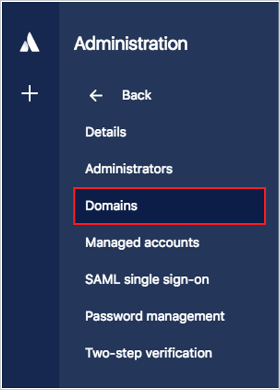
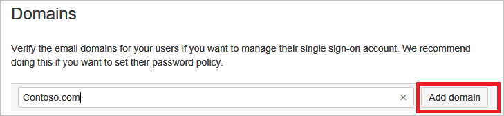
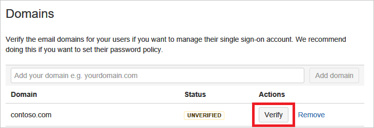
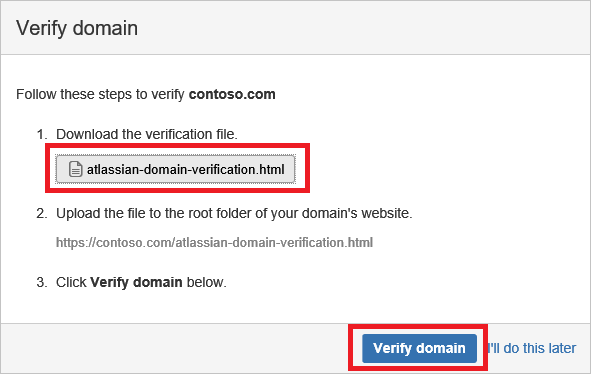
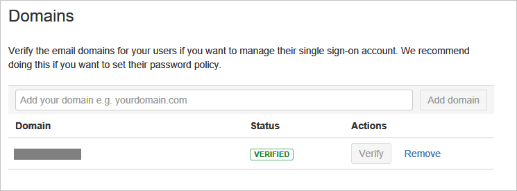
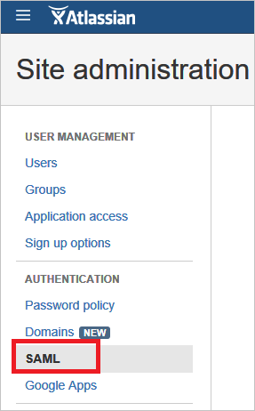
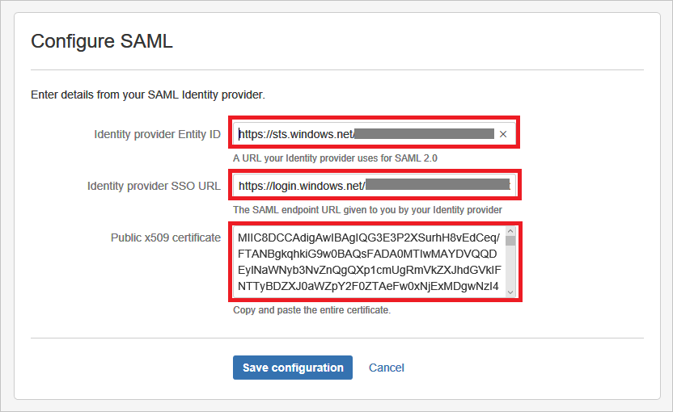
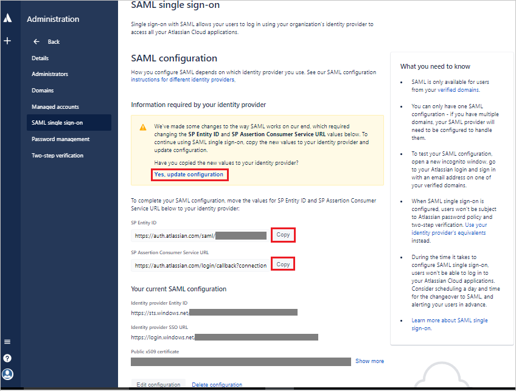

## Prerequisites

To configure Azure AD integration with Atlassian Cloud, you need the following items:

- An Azure AD subscription
- An Atlassian Cloud single-sign on enabled subscription

> **Note:**
> To test the steps in this tutorial, we do not recommend using a production environment.

To test the steps in this tutorial, you should follow these recommendations:

- Do not use your production environment, unless it is necessary.
- If you don't have an Azure AD trial environment, you can get a one-month trial [here](https://azure.microsoft.com/pricing/free-trial/).

### Configuring Atlassian Cloud for single sign-on

1. To get SSO configured for your application, login to the Atlassian Portal using the administrator rights.

2. In the Authentication section of the left navigation click **Domains**.

	

    a. In the textbox, type your domain name, and then click **Add domain**.
		
	

    b. To verify the domain, click **Verify**. 

	

    c. Download the domain verification html file, upload it to the root folder of your domain's website, and then click **Verify domain**.
	
	

    d. Once the domain is verified, the value of the **Status** field is **Verified**.

	

3. In the left navigation bar, click **SAML**.
 
	

4. Create a SAML Configuration and add the Identity provider configuration.
  
     a. Enter **Azure AD SMAL Entity ID**: %metadata:IssuerUri% in the Identity Provider Entity ID field.
  
     b. Enter **Azure AD Single Sign-On Service URL**: %metadata:singleSignOnServiceUrl% in the Identity Provider SSO URL box.
  
     c. Open the **[Downloaded Metadata Certificate (Base64 encoded)](%metadata:certificateDownloadBase64Url%)** from Azure AD and copy the values without the Begin and End lines and paste it in the Public X509 certificate box.
  
     d. Save the settings.

      
 
5. Update the Azure AD settings to make sure that you have setup the correct Identifier URL.
  
    a. Copy the SP Identity ID from the SAML screen and paste it in Azure AD as the **Identifier** value.

    b. Sign On URL is the tenant URL of your Atlassian Cloud. 	

     
	
6. In the Azure Portal, Click **Save** button.

	

## Quick Reference

* **Azure AD Single Sign-On Service URL**: %metadata:singleSignOnServiceUrl%

* **Azure AD SAML Entity ID**: %metadata:IssuerUri%

* **[Download Azure AD Signing Certificate (Base64 encoded)](%metadata:certificateDownloadBase64Url%)**

## Additional Resources

* [How to integrate Atlassian Cloud with Azure Active Directory](https://docs.microsoft.com/en-us/azure/active-directory/active-directory-saas-atlassian-cloud-tutorial)

