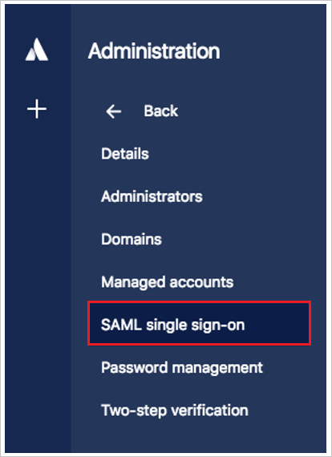
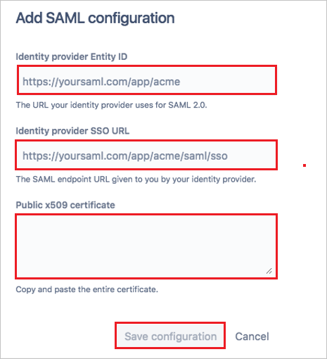

## Prerequisites

To configure Azure AD integration with Atlassian Cloud, you need the following items:

- An Azure AD subscription
- A Atlassian Cloud single sign-on enabled subscription

> **Note:**
> To test the steps in this tutorial, we do not recommend using a production environment.

To test the steps in this tutorial, you should follow these recommendations:

- Do not use your production environment, unless it is necessary.
- If you don't have an Azure AD trial environment, you can [get a one-month trial](https://azure.microsoft.com/pricing/free-trial/).

### Configuring Atlassian Cloud for single sign-on

1. To get SSO configured for your application, sign in to the Atlassian portal with administrator credentials.

2. You need to verify your domain before going to configure single sign-on. For more information, see [Atlassian domain verification](https://confluence.atlassian.com/cloud/domain-verification-873871234.html) document.

3. In the left pane, select **SAML single sign-on**. If you haven't already done so, subscribe to Atlassian Identity Manager.

	

4. In the **Add SAML configuration** window, do the following:

	

	a. In the **Identity provider Entity ID** box, paste the **Azure AD SAML Entity ID** : %metadata:IssuerUri% that you copied from the Azure portal.

    b. In the **Identity provider SSO URL** box, paste the **Azure AD Single Sign-On Service URL** : %metadata:singleSignOnServiceUrl% that you copied from the Azure portal.

    c. Open the **[Downloaded Azure AD Signing Certifcate (Base64 encoded)](%metadata:certificateDownloadBase64Url%)** from the Azure portal in a .txt file, copy the value (without the *Begin Certificate* and *End Certificate* lines), and then paste it in the **Public X509 certificate** box.
    
    d. Select **Save Configuration**.
     
5. To ensure that you have set up the correct URLs, update the Azure AD settings by doing the following:

    

	a. In the SAML window, copy the **SP Identity ID** and then, in the Azure portal, under Atlassian Cloud **Domain and URLs**, paste it in the **Identifier** box.
	
	b. In the SAML window, copy the **SP Assertion Consumer Service URL** and then, in the Azure portal, under Atlassian Cloud **Domain and URLs**, paste it in the **Reply URL** box. The sign-on URL is the tenant URL of your Atlassian Cloud.

	> **Note:**
	> If you're an existing customer, after you update the **SP Identity ID** and **SP Assertion Consumer Service URL** values in the Azure portal, select **Yes, update configuration**. If you're a new customer, you can skip this step.
	
6. In the Azure portal, select **Save**.

	

## Quick Reference

* **Azure AD Single Sign-On Service URL** : %metadata:singleSignOnServiceUrl%

* **Azure AD SAML Entity ID** : %metadata:IssuerUri%

* **[Download Azure AD Signing Certifcate (Base64 encoded)](%metadata:certificateDownloadBase64Url%)**

## Additional Resources

* [How to integrate Atlassian Cloud with Azure Active Directory](https://docs.microsoft.com/en-us/azure/active-directory/active-directory-saas-atlassian-cloud-tutorial)
