## Prerequisites

To configure Azure AD integration with Amazon Web Services (AWS), you need the following items:

- An Azure AD subscription
- A Amazon Web Services (AWS) single sign-on enabled subscription

> **Note:**
> To test the steps in this tutorial, we do not recommend using a production environment.

To test the steps in this tutorial, you should follow these recommendations:

- Do not use your production environment, unless it is necessary.
- If you don't have an Azure AD trial environment, you can [get a one-month trial](https://azure.microsoft.com/pricing/free-trial/).

### Configuring Amazon Web Services (AWS) for single sign-on

1. In a different browser window, sign-on to your Amazon Web Services (AWS) company site as administrator.

2. Click **AWS Home**.
   
    ![Configure Single Sign-On home][11]

3. Click **Identity and Access Management**. 
   
    ![Configure Single Sign-On Identity][12]

4. Click **Identity Providers**, and then click **Create Provider**. 
   
    ![Configure Single Sign-On Provider][13]

5. On the **Configure Provider** dialog page, perform the following steps: 
   
    ![Configure Single Sign-On dialog][14]
 
  	a. As **Provider Type**, select **SAML**.

  	b. In the **Provider Name** textbox, type a provider name (for example: *WAAD*).

  	c. To upload your **[Downloaded SAML Metadata file](%metadata:metadataDownloadUrl%)** from Azure portal, click **Choose File**.

  	d. Click **Next Step**.

6. On the **Verify Provider Information** dialog page, click **Create**. 
    
    ![Configure Single Sign-On Verify][15]

7. Click **Roles**, and then click **Create role**. 
    
    ![Configure Single Sign-On Roles][16]

8. On the **Create role** page, perform the following steps:  
    
    ![Configure Single Sign-On Trust][19] 

    a. Select **SAML 2.0 federation** under **Select type of trusted entity**.

	b. Under **Choose a SAML 2.0 Provider section**, select the **SAML provider** you have created previously (for example: *WAAD*)

	c. Select **Allow programmatic and AWS Management Console access**.
  
    d. Click **Next: Permissions**.

9. On the **Attach Permissions Policies** dialog, click **Next: Review**.  
    
    ![Configure Single Sign-On Policy][33]

10. On the **Review** dialog, perform the following steps:   
    
    ![Configure Single Sign-On Review][34] 

	a. In the **Role name** textbox, enter your Role name.

	b. In the **Role description** textbox, enter the description.

    c. Click **Create Role**.

    d. Create as many roles as needed and map them to the Identity Provider.

11. Use AWS service account credentials for fetching the roles from AWS account in Azure AD User Provisioning. For this, open the AWS console home.

12. Click on **Services** -> **Security, Identity& Compliance** -> **IAM**.

	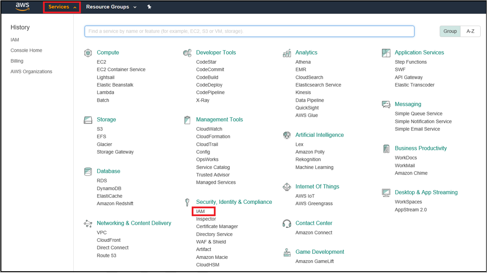

13. Select the **Policies** tab in the IAM section.

	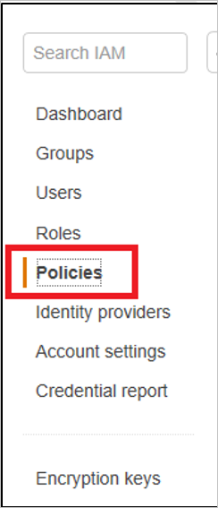

14. Create a new policy by clicking on **Create policy** for fetching the roles from AWS account in Azure AD User Provisioning.

	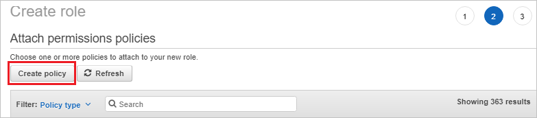

15. Create your own policy to fetch all the roles from AWS accounts by performing the following steps:

	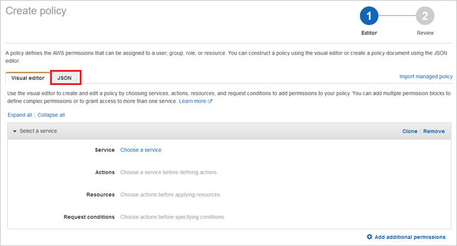

	a. In the **“Create policy”** section click on **“JSON”** tab.

	b. In the policy document, add the below JSON.
	
	```
	
	{

	"Version": "2012-10-17",

	"Statement": [

	{

	"Effect": "Allow",
		
	"Action": [
		
	"iam:ListRoles"
		
	],

	"Resource": "*"

	}

	]

	}
	
	```

	c. Click on **Review Policy button** to validate the policy.

	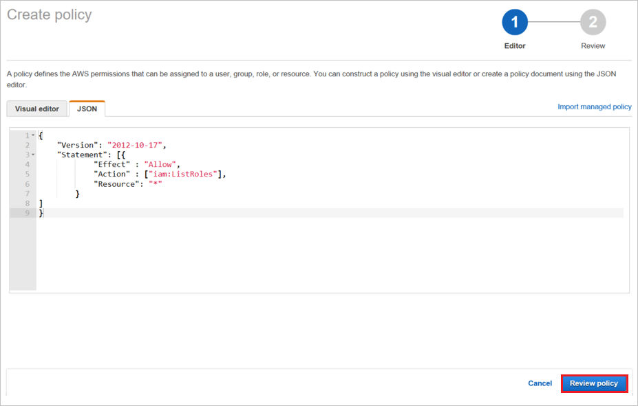

16. Define the **new policy** by performing the following steps:

	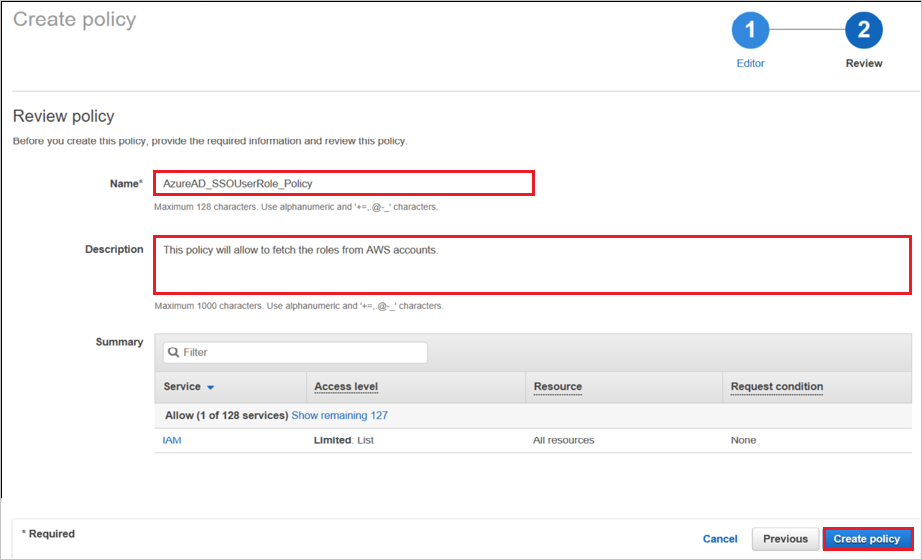

	a. Provide the **Policy Name** as **AzureAD_SSOUserRole_Policy**.

	b. You can provide **Description** to the policy as **This policy will allow to fetch the roles from AWS accounts**.
	
	c. Click on **“Create Policy”** button.

17.	Create a new user account in the AWS IAM Service by performing the following steps:

	a. Click on **Users** navigation in the AWS IAM console.

	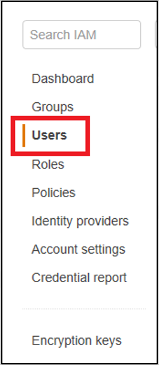
	
	b. Click on **Add user** button to create a new user.

	

	c. In the **Add user** section, perform the following steps:
	
	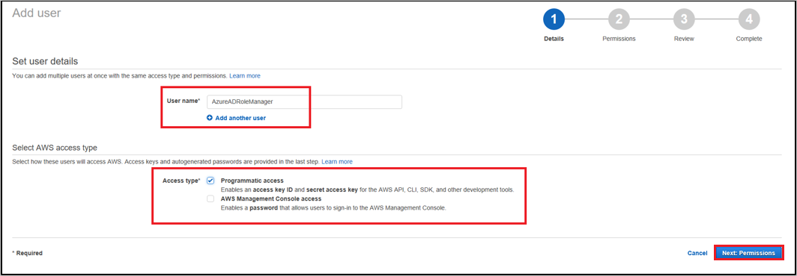
	
	* Enter the user name as **AzureADRoleManager**.
	
	* In the Access type, select the **Programmatic access** option. This way the user can invoke the APIs and fetch the roles from AWS account.
	
	* Click on the **Next Permissions** button in the bottom right corner.

18. Now create a new policy for this user by performing the following steps:

	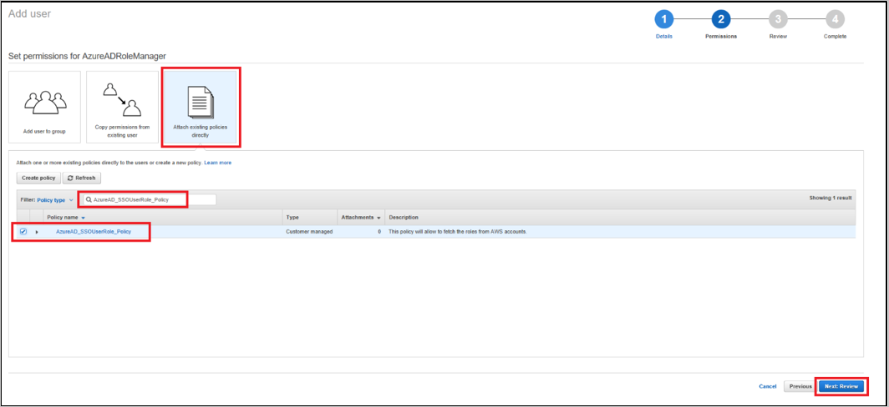
	
	a. Click on the **Attach existing policies directly** button.

	b. Search for the newly created policy in the filter section **AzureAD_SSOUserRole_Policy**.
	
	c. Select the **policy** and then click on the **Next: Review** button.

19.	Review the policy to the attached user by performing following steps:

	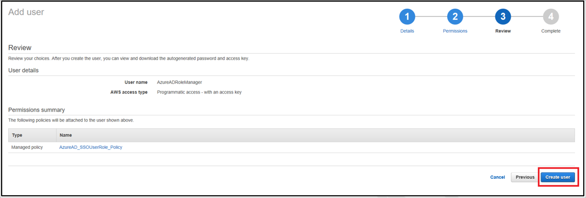
	
	a. Review the user name, access type, and policy mapped to the user.
	
	b. Click on the **Create user** button at the bottom right corner to create the user.

20. Download the user credentials of a user by performing following steps:

	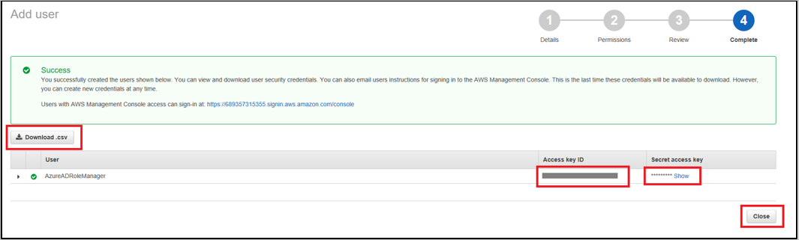
	
	a. Copy the user **Access key ID** and **Secret access key**.
	
	b. Enter these credentials into Azure AD user provisioning section to fetch the roles from AWS console.
	
	c. Click on **Close** button at the bottom.

21. Navigate to **User Provisioning** section of Amazon Web Services app in Azure AD Management Portal.

	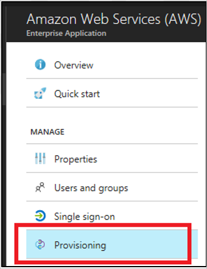

22. Enter the **Access Key** and **Secret** in the **Client Secret** and **Secret Token** field respectively.

	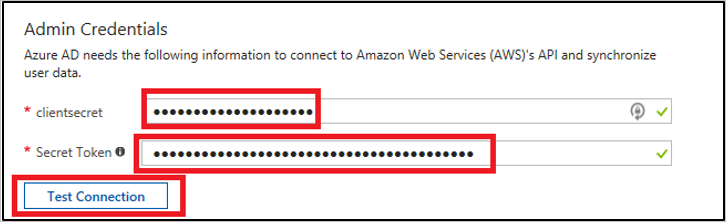
	
	a. Enter the AWS user access key in the **clientsecret** field.
	
	b. Enter the AWS user secret in the **Secret Token** field.
	
	c. Click on the **Test Connection** button and you should able to successfully test this connection.

	d. Save the setting by clicking on the **Save** button at the top.
 
23. Now make sure that you enable the Provisioning Status **On** in the Settings section by making the switch on and then clicking on the **Save** button at the top.

	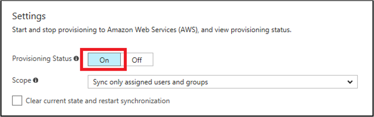

## Quick Reference

* **[Download SAML Metadata file](%metadata:metadataDownloadUrl%)**

## Additional Resources

* [How to integrate Amazon Web Services (AWS) with Azure Active Directory](https://docs.microsoft.com/azure/active-directory/active-directory-saas-amazon-web-service-tutorial)


<!--Image references-->

[1]: ./media/tutorial_general_01.png
[2]: ./media//tutorial_general_02.png
[3]: ./media/tutorial_general_03.png
[4]: ./media/tutorial_general_04.png

[100]: ./media/tutorial_general_100.png

[200]: ./media/tutorial_general_200.png
[201]: ./media/tutorial_general_201.png
[202]: ./media/tutorial_general_202.png
[203]: ./media/tutorial_general_203.png
[11]: ./media/ic795031.png
[12]: ./media/ic795032.png
[13]: ./media/ic795033.png
[14]: ./media/ic795034.png
[15]: ./media/ic795035.png
[16]: ./media/ic795022.png
[17]: ./media/ic795023.png
[18]: ./media/ic795024.png
[19]: ./media/ic795025.png
[32]: ./media/ic7950251.png
[33]: ./media/ic7950252.png
[35]: ./media/tutorial_amazonwebservices_provisioning.png
[34]: ./media/ic7950253.png
[36]: ./media/tutorial_amazonwebservices_securitycredentials.png
[37]: ./media/tutorial_amazonwebservices_securitycredentials_continue.png
[38]: ./media/tutorial_amazonwebservices_createnewaccesskey.png
[39]: ./media/tutorial_amazonwebservices_provisioning_automatic.png
[40]: ./media/tutorial_amazonwebservices_provisioning_testconnection.png
[41]: ./media/tutorial_amazonwebservices_provisioning_on.png