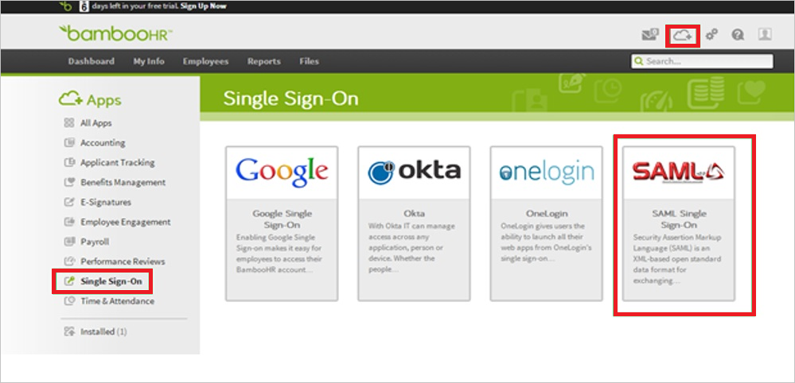
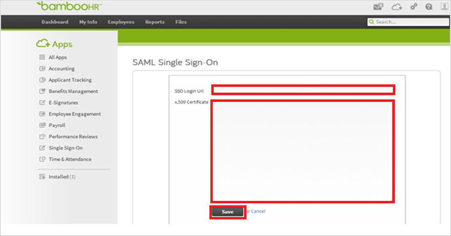

## Prerequisites

To configure Azure AD integration with BambooHR, you need the following items:

- An Azure AD subscription
- A BambooHR single-sign on enabled subscription

> **Note:**
> To test the steps in this tutorial, we do not recommend using a production environment.

To test the steps in this tutorial, you should follow these recommendations:

- You should not use your production environment, unless this is necessary.
- If you don't have an Azure AD trial environment, you can get an one-month trial [here](https://azure.microsoft.com/pricing/free-trial/).

### Configuring BambooHR for single sign-on

1. In a different web browser window, log into your BambooHR company site as an administrator.

2. On the homepage, perform the following steps:
   
       

    a. Click **Apps**.
   
    b. In the apps menu on the left, click **Single Sign-On**.
   
    c. Click **SAML Single Sign-On**.

3. In the **SAML Single Sign-On** section, perform the following steps:
   
    
   
    a. Paste the **Azure AD Single Sign-On Service URL** : %metadata:singleSignOnServiceUrl% value into the **SSO Login Url** textbox.
      
    b. Open [base-64 encoded certificate](%metadata:certificateDownloadBase64Url%) downloaded from Azure portal in notepad, copy the content of it into your clipboard, and then paste it to the **X.509 Certificate** textbox
   
    c. Click **Save**.

## Quick Reference

* **Azure AD Single Sign-On Service URL** : %metadata:singleSignOnServiceUrl%

* **Azure AD Sign Out URL** : %metadata:singleSignOutServiceUrl%

* **[Download Azure AD Signing Certifcate (Base64 encoded)](%metadata:certificateDownloadBase64Url%)**

## Additional Resources

* [How to integrate BambooHR with Azure Active Directory](https://docs.microsoft.com/azure/active-directory/active-directory-saas-bamboo-hr-tutorial)
