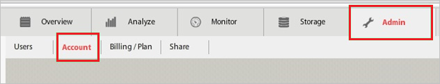
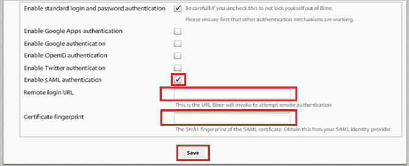

## Prerequisites

To configure Azure AD integration with Bime, you need the following items:

- An Azure AD subscription
- A Bime single sign-on enabled subscription

> **Note:**
> To test the steps in this tutorial, we do not recommend using a production environment.

To test the steps in this tutorial, you should follow these recommendations:

- Do not use your production environment, unless it is necessary.
- If you don't have an Azure AD trial environment, you can get a one-month trial here: [Trial offer](https://azure.microsoft.com/pricing/free-trial/).

### Configuring Bime for single sign-on

1. In a different web browser window, log into your Bime company site as an administrator.

2. In the toolbar, click **Admin**, and then **Account**.
   
    

3. On the account configuration page, perform the following steps:
   
    
   
    a. Select **Enable SAML authentication**.

    b. In the **Remote Login URL** textbox, paste the value of **Azure AD Single Sign-On Service URL** : %metadata:singleSignOnServiceUrl%, which you have copied from Azure portal.

    c.  Paste the **Thumbprint** value from Azure portal into the **Certificate Fingerprint** textbox.       
   
    d. Click **Save**.

## Quick Reference

* **Azure AD Single Sign-On Service URL** : %metadata:singleSignOnServiceUrl%

* **[Download Azure AD Signing Certifcate](%metadata:CertificateDownloadRawUrl%)**

## Additional Resources

* [How to integrate Bime with Azure Active Directory](https://docs.microsoft.com/azure/active-directory/active-directory-saas-bime-tutorial)
