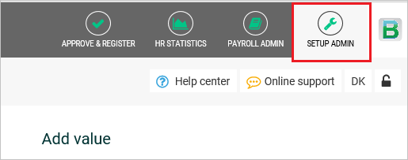
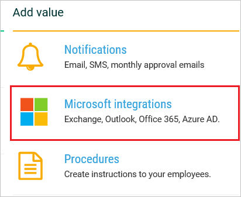
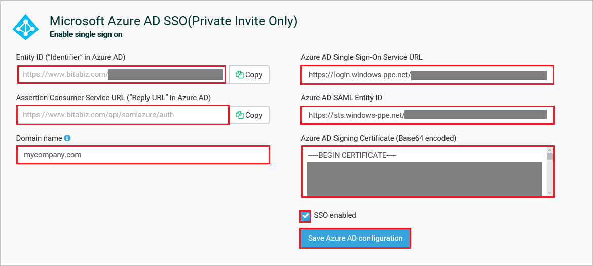

## Prerequisites

To configure Azure AD integration with BitaBIZ, you need the following items:

- An Azure AD subscription
- A BitaBIZ single sign-on enabled subscription

> **Note:**
> To test the steps in this tutorial, we do not recommend using a production environment.

To test the steps in this tutorial, you should follow these recommendations:

- Do not use your production environment, unless it is necessary.
- If you don't have an Azure AD trial environment, you can [get a one-month trial](https://azure.microsoft.com/pricing/free-trial/).

### Configuring BitaBIZ for single sign-on

1. In a different web browser window, sign-on to your BitaBIZ tenant as an administrator.

2. Click on **SETUP ADMIN**.

	

3. Click on **Microsoft integrations** under **Add value** section.

	

4. Scroll down to the section **Microsoft Azure AD (Enable single sign on)** and perform following steps:

	

	a. Copy the value from the **Entity ID (”Identifier” in Azure AD)** textbox and paste it into the **Identifier** textbox on the **BitaBIZ Domain and URLs** section in Azure portal. 
	
	b. Copy the value from the **Assertion Consumer Service URL (”Reply URL” in Azure AD)** textbox and paste it into the **Reply URL** textbox on the **BitaBIZ Domain and URLs** section Azure portal.  
	
	c. In the **Azure AD Single Sign-On Service URL** textbox, paste **Azure AD Single Sign-On Service URL** : %metadata:singleSignOnServiceUrl%, which you have copied from Azure portal.
	
	d. In the **Azure AD SAML Entity ID** textbox, paste **Azure AD SAML Entity ID** : %metadata:IssuerUri%, which you have copied from Azure portal.

	e. Open your **[Downloaded Azure AD Signing Certifcate (Base64 encoded)](%metadata:certificateDownloadBase64Url%)** file in notepad, copy the content of it into your clipboard, and then paste it to the **Azure AD Signing Certificate (Base64 encoded)** textbox.

	f. Add your business e-mail domain name that is, mycompany.com in **Domain name** textbox to assign SSO to the users in your company with this email domain (NOT MANDATORY).
	
	g. Mark **SSO enabled** the BitaBIZ account.
	
	h. Click **Save Azure AD configuration** to save and activate the SSO configuration.

## Quick Reference

* **Azure AD Single Sign-On Service URL** : %metadata:singleSignOnServiceUrl%

* **Azure AD SAML Entity ID** : %metadata:IssuerUri%

* **[Download Azure AD Signing Certifcate (Base64 encoded)](%metadata:certificateDownloadBase64Url%)**

## Additional Resources

* [How to integrate BitaBIZ with Azure Active Directory](https://docs.microsoft.com/azure/active-directory/active-directory-saas-bitabiz-tutorial)
