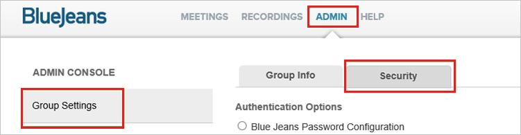
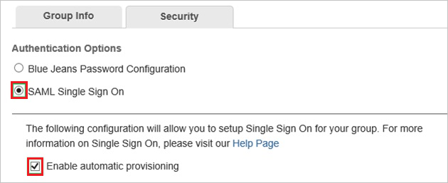
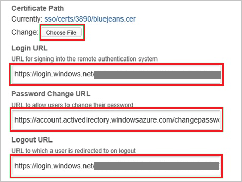
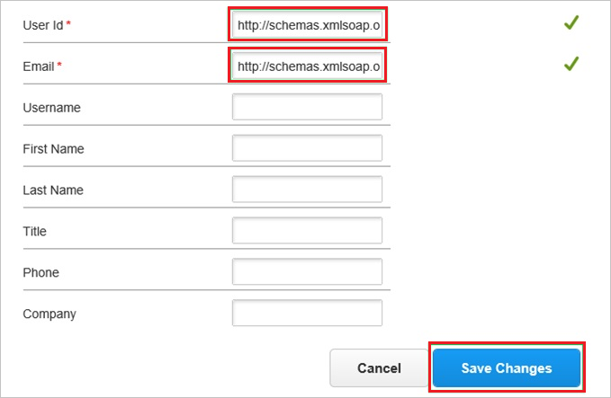

## Prerequisites

To configure Azure AD integration with BlueJeans, you need the following items:

- An Azure AD subscription
- A BlueJeans single-sign on enabled subscription

> **Note:**
> To test the steps in this tutorial, we do not recommend using a production environment.

To test the steps in this tutorial, you should follow these recommendations:

- Do not use your production environment, unless it is necessary.
- If you don't have an Azure AD trial environment, you can get a one-month trial [here](https://azure.microsoft.com/pricing/free-trial/).

### Configuring BlueJeans for single sign-on

1. In a different web browser window, log in to your **BlueJeans** company site as an administrator.

2. Go to **ADMIN \> Group Settings \> Security**.
   
   

3. In the **Security** section, perform the following steps:
   
      
   
   a. Select **SAML Single Sign On**.
  
   b. Select **Enable automatic provisioning**.

4. Move on with the following steps:

	
	
	a. Click **Choose File**, and then upload the **[Downloaded Azure AD Signing Certifcate (Base64 encoded)](%metadata:certificateDownloadBase64Url%)**.
   
    b. Paste **Azure AD Single Sign-On Service URL** : %metadata:singleSignOnServiceUrl% into the **Login URL** textbox.
   
    c. Paste **Change Password URL** into the **Password Change URL** textbox.
   
    d. Paste **Azure AD Sign Out URL** : %metadata:singleSignOutServiceUrl% into the **Logout URL** textbox.

5. Move on with the following steps:
	
	
	
	a. In the **User id** textbox, type `http://schemas.xmlsoap.org/ws/2005/05/identity/claims/name`.
   
    b. In the **Email** textbox, type `http://schemas.xmlsoap.org/ws/2005/05/identity/claims/name`.
   
    c. Click **Save Changes**.

## Quick Reference

* **Azure AD Single Sign-On Service URL** : %metadata:singleSignOnServiceUrl%

* **Azure AD Sign Out URL** : %metadata:singleSignOutServiceUrl%

* **[Download Azure AD Signing Certifcate (Base64 encoded)](%metadata:certificateDownloadBase64Url%)**

## Additional Resources

* [How to integrate BlueJeans with Azure Active Directory](https://docs.microsoft.com/azure/active-directory/active-directory-saas-bluejeans-tutorial)
