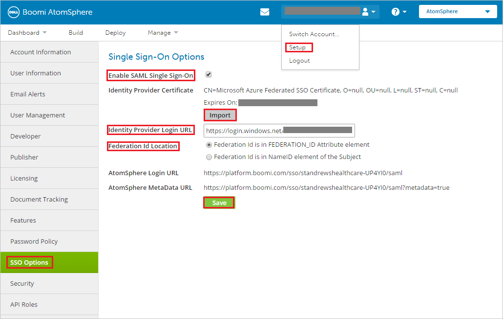

## Prerequisites

To configure Azure AD integration with Boomi, you need the following items:

- An Azure AD subscription
- A Boomi single sign-on enabled subscription

> **Note:**
> To test the steps in this tutorial, we do not recommend using a production environment.

To test the steps in this tutorial, you should follow these recommendations:

- Do not use your production environment, unless it is necessary.
- If you don't have an Azure AD trial environment, you can get a one-month trial [here](https://azure.microsoft.com/pricing/free-trial/).

### Configuring Boomi for single sign-on

1. In a different web browser window, log into your Boomi company site as an administrator. 

2. Navigate to **Company Name** and go to **Set up**.

3. Click the **SSO Options** tab and perform below steps.

	

	a. Check **Enable SAML Single Sign-On** checkbox.

	b. Click **Import** to upload the **[Downloaded Azure AD Signing Certifcate (Base64 encoded)](%metadata:certificateDownloadBase64Url%)** from Azure AD to **Identity Provider Certificate**.
	
	c. In the **Identity Provider Login URL** textbox, put the value of **Azure AD Single Sign-On Service URL** : %metadata:singleSignOnServiceUrl% from Azure AD application configuration window.

	d. As **Federation Id Location**, select **Federation Id is in FEDERATION_ID Attribute element** radio button. 

	e. Click **Save** button.

## Quick Reference

* **Azure AD Single Sign-On Service URL** : %metadata:singleSignOnServiceUrl%

* **[Download Azure AD Signing Certifcate (Base64 encoded)](%metadata:certificateDownloadBase64Url%)**

## Additional Resources

* [How to integrate Boomi with Azure Active Directory](https://docs.microsoft.com/azure/active-directory/active-directory-saas-boomi-tutorial)
