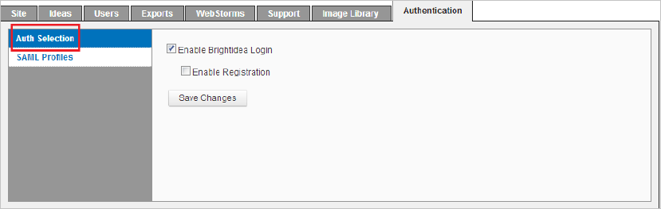
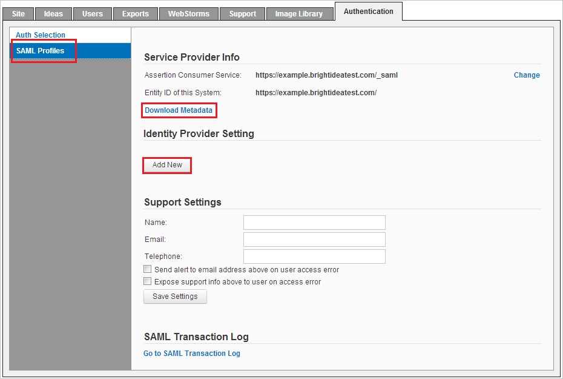
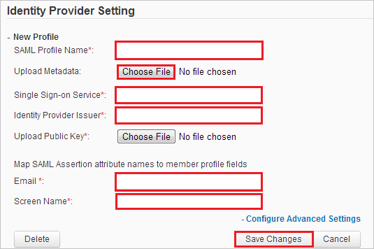

## Prerequisites

To configure Azure AD integration with Brightidea, you need the following items:

- An Azure AD subscription
- A Brightidea single sign-on enabled subscription

> **Note:**
> To test the steps in this tutorial, we do not recommend using a production environment.

To test the steps in this tutorial, you should follow these recommendations:

- Do not use your production environment, unless it is necessary.
- If you don't have an Azure AD trial environment, you can [get a one-month trial](https://azure.microsoft.com/pricing/free-trial/).

### Configuring Brightidea for single sign-on

1. In a different web browser window, Log in to Brightidea using the administrator credentials.

2. To get to the SSO feature in your Brightidea system, navigate to **Enterprise Setup** -> **Authentication Tab**. There you will see two sub tabs: Auth Selection & SAML Profiles.

	

3. Select **Auth Selection**, By default, it only shows two standard methods: Brightidea Login & Registration. When a SSO method added, it will show up in the list.

	

4. Select **SAML Profiles** and perform the following steps:

	

	a. Click on the **Download Metadata** and upload at the **Basic SAML Configuration** section in the Azure portal.

	b. Click on the **Add New** button under the **Identity Provider Setting** and perform the following steps:

	

	 * Enter the **SAML Profile Name** like e.g `Azure Ad SSO`

	 * For **Upload Metadata**, click choose file and upload the **[Downloaded SAML Metadata file](%metadata:metadataDownloadUrl%)** from the Azure portal.

	 > **Note:**
	 > After uploading the metadata file, the remaining fields **Azure AD Single Sign-On Service URL** : %metadata:singleSignOnServiceUrl%, **Identity Provider Issuer, Upload Public Key** will populate automatically.

	 * In the **Email** textbox, enter the value as `mail`.

	 * In the **Screen Name** textbox, enter the value as `givenName`.

	 * Click **Save Changes**.  

## Quick Reference

* **Azure AD Single Sign-On Service URL** : %metadata:singleSignOnServiceUrl%

* **[Download Azure AD Signing Certifcate](%metadata:CertificateDownloadRawUrl%)**

* **[Download SAML Metadata file](%metadata:metadataDownloadUrl%)**

## Additional Resources

* [How to integrate Brightidea with Azure Active Directory](https://docs.microsoft.com/azure/active-directory/saas-apps/brightidea-tutorial)
