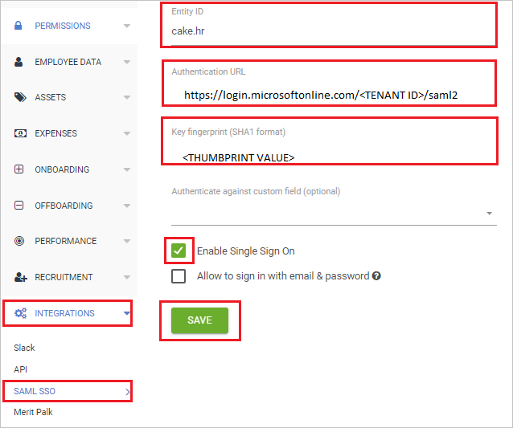

## Prerequisites

To configure Azure AD integration with CakeHR, you need the following items:

- An Azure AD subscription
- A CakeHR single sign-on enabled subscription

> **Note:**
> To test the steps in this tutorial, we do not recommend using a production environment.

To test the steps in this tutorial, you should follow these recommendations:

- Do not use your production environment, unless it is necessary.
- If you don't have an Azure AD trial environment, you can get a [free account](https://azure.microsoft.com/free/).

### Configuring CakeHR for single sign-on

1. Open a new web browser window and sign into your CakeHR company site as an administrator.

2. On the top-right corner of the page, click on **Profile** and then navigate to **Settings**.

    

3. From the left side of the menu bar, click on **INTEGRATIONS** > **SAML SSO** and perform the following steps:

     

     a. In the **Entity ID** text box, type `cake.hr`.

     b. In the **Authentication URL** text box, paste the value of **Login URL** : %metadata:singleSignOnServiceUrl%, which you have copied from Azure portal.

     c. In the **Key fingerprint (SHA1 format)** text box, paste the **THUMBPRINT** value, which you have copied from Azure portal.

     d. Check the **Enable Single Sign on** box.

     e. Click **Save**.

## Quick Reference

* **Login URL** : %metadata:singleSignOnServiceUrl%

* **[Download Azure AD Signing Certifcate (Base64 encoded)](%metadata:certificateDownloadBase64Url%)**

## Additional Resources

* [How to integrate CakeHR with Azure Active Directory](https://docs.microsoft.com/azure/active-directory/saas-apps/cakehr-tutorial)
