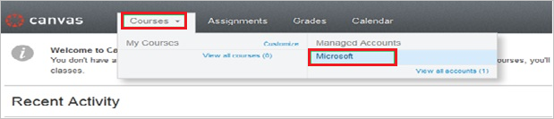
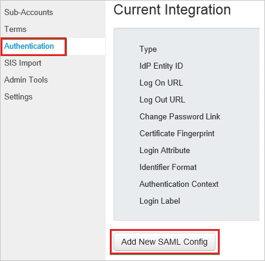
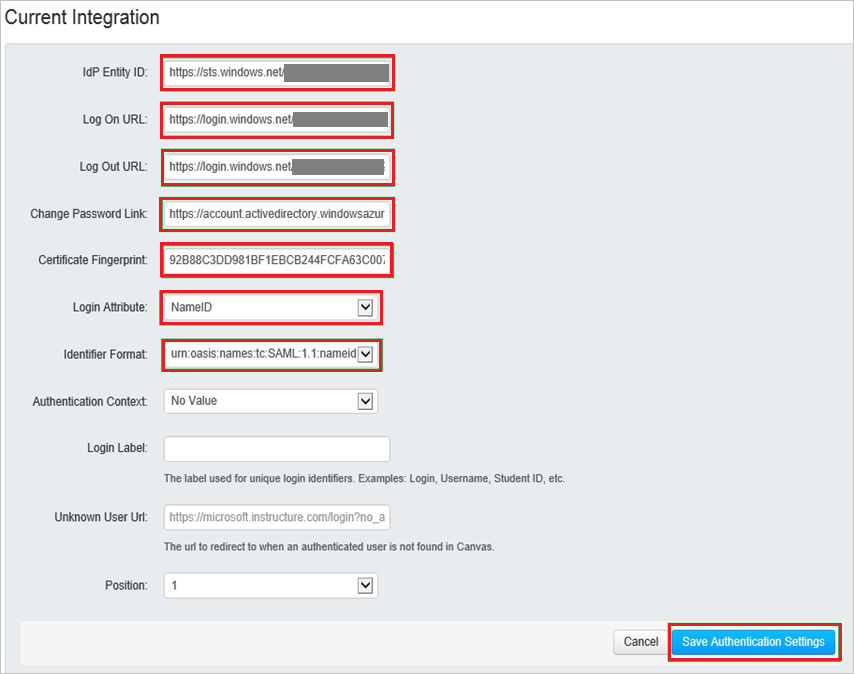

## Prerequisites

To configure Azure AD integration with Canvas Lms, you need the following items:

- An Azure AD subscription
- A Canvas Lms single sign-on enabled subscription

> **Note:**
> To test the steps in this tutorial, we do not recommend using a production environment.

To test the steps in this tutorial, you should follow these recommendations:

- Do not use your production environment, unless it is necessary.
- If you don't have an Azure AD trial environment, you can [get a one-month trial](https://azure.microsoft.com/pricing/free-trial/).

### Configuring Canvas Lms for single sign-on

1. In a different web browser window, log in to your Canvas company site as an administrator.

2. Go to **Courses \> Managed Accounts \> Microsoft**.
   
    

3. In the navigation pane on the left, select **Authentication**, and then click **Add New SAML Config**.
   
    

4. On the Current Integration page, perform the following steps:
   
    

    a. Paste **SAML Entity ID** into the **IdP Entity ID** textbox.

    b. Paste **SAML Single Sign-On Service URL** into the **Log On URL** textbox.

    c. Paste **Sign-Out URL** into the **Log Out URL** textbox.

    d. In the Azure portal, on the **Configure single sign-on at Canvas** dialog page, copy the **Change Password URL** value, and then paste it into the **Change Password Link** textbox.

    e. Copy the **Thumbprint** value from the exported certificate, and then paste it into the **Certificate Fingerprint** textbox.      
      >[!TIP]
      >For more information, see [How to retrieve a certificate's thumbprint value](http://youtu.be/YKQF266SAxI) 
      
    f. From the **Login Attribute** list, select **NameID**.

    g. From the **Identifier Format** list, select **emailAddress**.

    h. Click **Save Authentication Settings**.

## Quick Reference

## Additional Resources

* [How to integrate Canvas Lms with Azure Active Directory](https://docs.microsoft.com/azure/active-directory/active-directory-saas-canvas-lms-tutorial)
