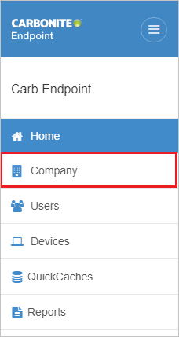
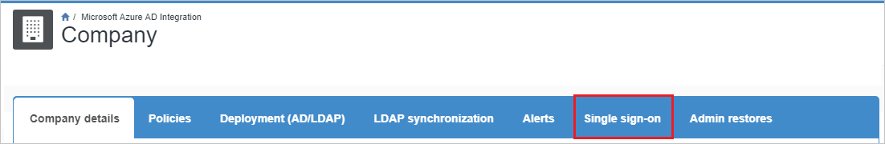
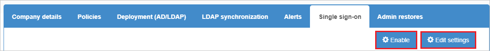
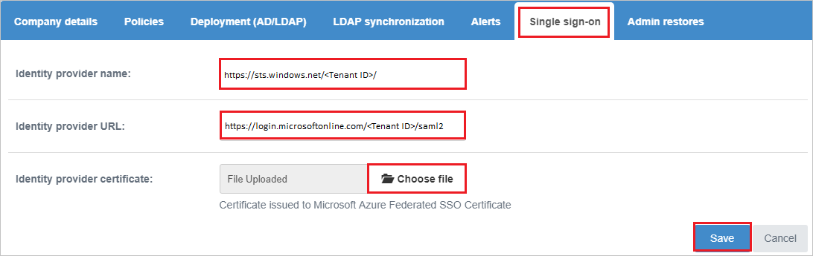

## Prerequisites

To configure Azure AD integration with Carbonite Endpoint Backup, you need the following items:

- An Azure AD subscription
- A Carbonite Endpoint Backup single sign-on enabled subscription

> **Note:**
> To test the steps in this tutorial, we do not recommend using a production environment.

To test the steps in this tutorial, you should follow these recommendations:

- Do not use your production environment, unless it is necessary.
- If you don't have an Azure AD trial environment, you can get a [free account](https://azure.microsoft.com/free/).

### Configuring Carbonite Endpoint Backup for single sign-on

1. In a different web browser window, sign in to your Carbonite Endpoint Backup company site as an administrator.

1. Click on the **Company** from the left pane.

    

1. Click on **Single sign-on**.

    

1. Click on **Enable** and then click **Edit settings** to configure.

    

1. On the **Single sign-on** settings page, perform the following steps:

    

    1. In the **Identity provider name** textbox, paste the **Azure AD Identifier** value, which you have copied from the Azure portal.

    1. In the **Identity provider URL** textbox, paste the **Login URL** : %metadata:singleSignOnServiceUrl% value, which you have copied from the Azure portal.

    1. Click on **Choose file** to upload the downloaded **Certificate(Base64)** file from the Azure portal.

    1. Click **Save**.

## Quick Reference

* **Login URL** : %metadata:singleSignOnServiceUrl%

* **[Download Azure AD Signing Certifcate](%metadata:CertificateDownloadRawUrl%)**

* **[Download SAML Metadata file](%metadata:metadataDownloadUrl%)**

## Additional Resources

* [How to integrate Carbonite Endpoint Backup with Azure Active Directory](https://docs.microsoft.com/azure/active-directory/saas-apps/carbonite-endpoint-backup-tutorial)
