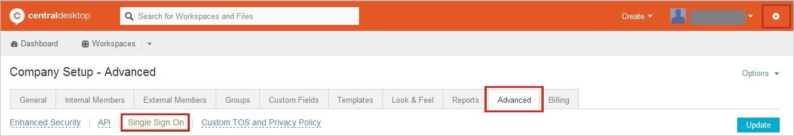
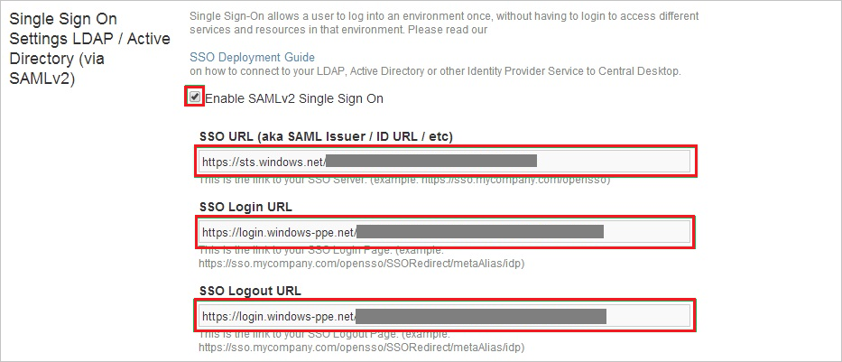
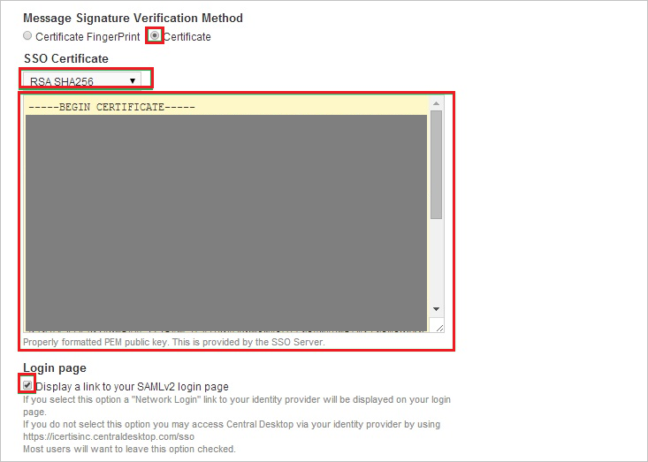

## Prerequisites

To configure Azure AD integration with Central Desktop, you need the following items:

- An Azure AD subscription
- A Central Desktop single sign-on enabled subscription

> **Note:**
> To test the steps in this tutorial, we do not recommend using a production environment.

To test the steps in this tutorial, you should follow these recommendations:

- Do not use your production environment, unless it is necessary.
- If you don't have an Azure AD trial environment, you can [get a one-month trial](https://azure.microsoft.com/pricing/free-trial/).

### Configuring Central Desktop for single sign-on

1. Log in to your **Central Desktop** tenant.

2. Go to **Settings**, click **Advanced**, and then click **Single Sign On**.

	

3. On the **Single Sign On Settings** page, perform the following steps:

	
	
	a. Select **Enable SAML v2 Single Sign On**.
	
	b. In the **SSO URL** textbox, paste the **Azure AD SAML Entity ID** : %metadata:IssuerUri% value which you have copied from the Azure portal.
	
	c. In the **SSO Login URL** textbox, paste the **Azure AD Single Sign-On Service URL** : %metadata:singleSignOnServiceUrl% value which you have copied from the Azure portal.
	
	d. In the **SSO Logout URL** textbox, paste the **Azure AD Sign Out URL** : %metadata:singleSignOutServiceUrl% value which you have copied from the Azure portal.

4. In the **Message Signature Verification Method** section, perform the following steps:

	
	a. Select **Certificate**.
	
	b. From the **SSO Certificate** list, select **RSH SHA256**.
	
	c. Open your **[Downloaded Azure AD Signing Certifcate](%metadata:CertificateDownloadRawUrl%)** in notepad, copy the content of certificate, and then paste it into the **SSO Certificate** field.
		
	d. Select **Display a link to your SAMLv2 login page**.
	
	e. Click **Update**.

## Quick Reference

* **Azure AD Single Sign-On Service URL** : %metadata:singleSignOnServiceUrl%

* **Azure AD Sign Out URL** : %metadata:singleSignOutServiceUrl%

* **Azure AD SAML Entity ID** : %metadata:IssuerUri%

* **[Download Azure AD Signing Certifcate](%metadata:CertificateDownloadRawUrl%)**

## Additional Resources

* [How to integrate Central Desktop with Azure Active Directory](https://docs.microsoft.com/azure/active-directory/active-directory-saas-central-desktop-tutorial)
