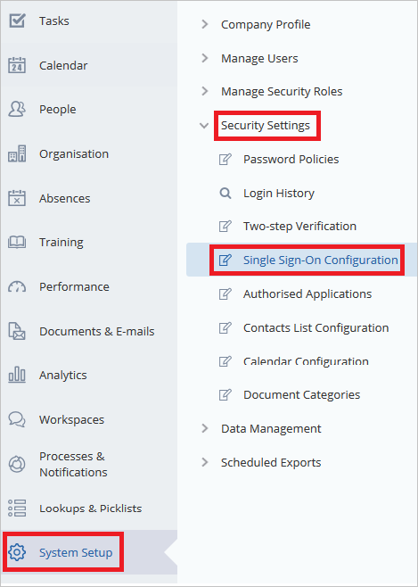
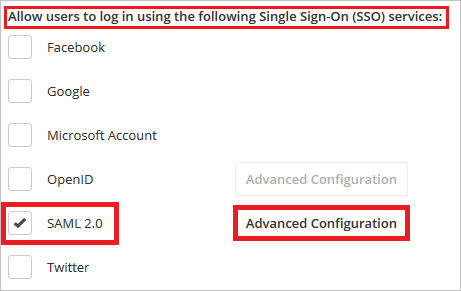
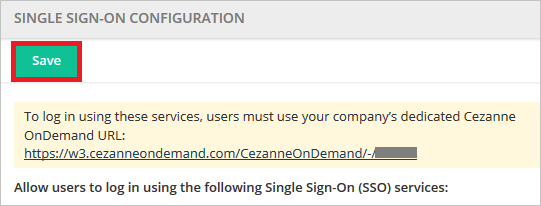

## Prerequisites

To configure Azure AD integration with Cezanne HR Software, you need the following items:

- An Azure AD subscription
- A Cezanne HR Software single sign-on enabled subscription

> **Note:**
> To test the steps in this tutorial, we do not recommend using a production environment.

To test the steps in this tutorial, you should follow these recommendations:

- Do not use your production environment, unless it is necessary.
- If you don't have an Azure AD trial environment, you can get a one-month trial [here](https://azure.microsoft.com/pricing/free-trial/).

### Configuring Cezanne HR Software for single sign-on

1. In a different web browser window, sign-on to your Cezanne HR Software tenant as an administrator.

2. On the left navigation pane, click **System Setup**. Go to **Security Settings**. Then navigate to **Single Sign-On Configuration**.

	

3. In the **Allow users to log in using the following Single Sign-On (SSO) Service** panel, check the **SAML 2.0** box and select the **Advanced Configuration** option.

	

4. Click **Add New** button.

	

5. Perform the following steps on **SAML 2.0 IDENTITY PROVIDERS** section.

	
	
	a. Enter the name of your Identity Provider as the **Display Name**.

	b. Paste **Azure AD SAML Entity ID** : %metadata:IssuerUri%, which you have copied from the Azure portal into the **Entity Identifier** textbox. 

	c. Change the **SAML Binding** to 'POST'.

	d.Paste **Azure AD Single Sign-On Service URL** : %metadata:singleSignOnServiceUrl%, which you have copied from the Azure portal into the **Security Token Service Endpoint** textbox. 
	
	e. In the User ID Attribute Name textbox, enter `http://schemas.xmlsoap.org/ws/2005/05/identity/claims/name`.
	
	f. Click **Upload** icon to upload the **[Downloaded Azure AD Signing Certifcate (Base64 encoded)](%metadata:certificateDownloadBase64Url%)** from Azure AD.
	
	g. Click the **Ok** button. 

6. Click **Save** button.

	

## Quick Reference

* **Azure AD Single Sign-On Service URL** : %metadata:singleSignOnServiceUrl%

* **Azure AD SAML Entity ID** : %metadata:IssuerUri%

* **[Download Azure AD Signing Certifcate (Base64 encoded)](%metadata:certificateDownloadBase64Url%)**

## Additional Resources

* [How to integrate Cezanne HR Software with Azure Active Directory](https://docs.microsoft.com/azure/active-directory/active-directory-saas-cezannehrsoftware-tutorial)
