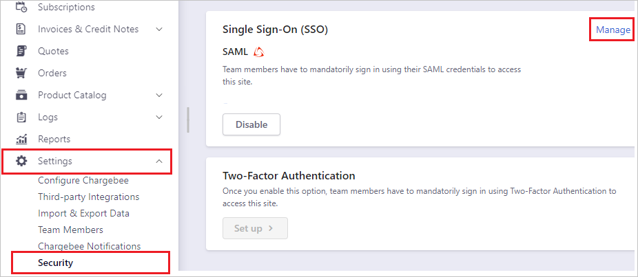
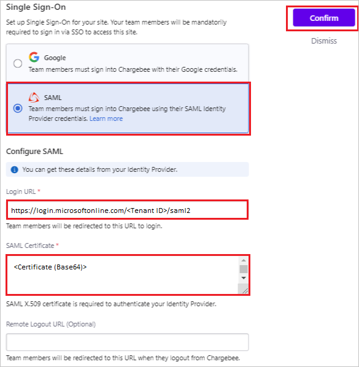

## Prerequisites

To configure Azure AD integration with Chargebee, you need the following items:

- An Azure AD subscription
- A Chargebee single sign-on enabled subscription

> **Note:**
> To test the steps in this tutorial, we do not recommend using a production environment.

To test the steps in this tutorial, you should follow these recommendations:

- Do not use your production environment, unless it is necessary.
- If you don't have an Azure AD trial environment, you can get a [free account](https://azure.microsoft.com/free/).

### Configuring Chargebee for single sign-on

1. Open a new web browser window and sign into your Chargebee company site as an administrator.

2. From the left side of menu, click on **Settings** > **Security** > **Manage**.

	

3. On the **Single Sign-On** pop-up, perform the following steps:

	

	a. Select **SAML**.

	b. In the **Login URL** text box, Paste the **Login URL** : %metadata:singleSignOnServiceUrl% value, which you have copied from the Azure portal.

	c. Open the Base64 encoded certificate in notepad, copy its content and paste it into the **SAML Certificate** text box.

	d. Click **Confirm**.

## Quick Reference

* **Login URL** : %metadata:singleSignOnServiceUrl%

* **[Download Azure AD Signing Certifcate](%metadata:CertificateDownloadRawUrl%)**

* **[Download SAML Metadata file](%metadata:metadataDownloadUrl%)**

## Additional Resources

* [How to integrate Chargebee with Azure Active Directory](https://docs.microsoft.com/azure/active-directory/saas-apps/chargebee-tutorial)
