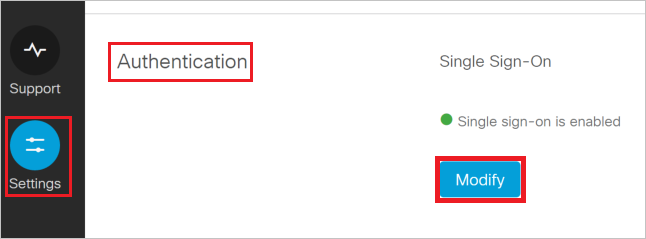
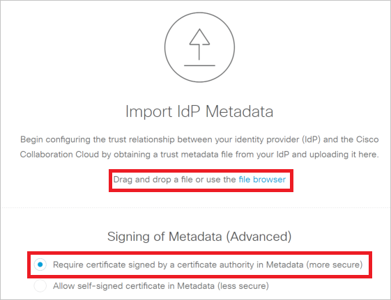

## Prerequisites

To configure Azure AD integration with Cisco Spark, you need the following items:

- An Azure AD subscription
- A Cisco Spark single-sign on enabled subscription

> **Note:**
> To test the steps in this tutorial, we do not recommend using a production environment.

To test the steps in this tutorial, you should follow these recommendations:

- Do not use your production environment, unless it is necessary.
- If you don't have an Azure AD trial environment, you can get a one-month trial [here](https://azure.microsoft.com/pricing/free-trial/).

### Configuring Cisco Spark for single sign-on

1. Sign in to [Cisco Cloud Collaboration Management](https://admin.ciscospark.com/) with your full administrator credentials.

2. Select **Settings** and under the **Authentication** section, click **Modify**.
   
    
    
3. Select **Integrate a 3rd-party identity provider. (Advanced)** and go to the next screen.

4. On the **Import Idp Metadata** page, either drag and drop the **[Downloaded SAML Metadata file](%metadata:metadataDownloadUrl%)** onto the page or use the file browser option to locate and upload the **[Downloaded SAML Metadata file](%metadata:metadataDownloadUrl%)**. Then, select **Require certificate signed by a certificate authority in Metadata (more secure)** and click **Next**. 
	
	

5. Select **Test SSO Connection**, and when a new browser tab opens, authenticate with Azure AD by signing in.

6. Return to the **Cisco Cloud Collaboration Management** browser tab. If the test was successful, select **This test was successful. Enable Single Sign-On option** and click **Next**.

## Quick Reference

* **[Download SAML Metadata file](%metadata:metadataDownloadUrl%)**

## Additional Resources

* [How to integrate Cisco Spark with Azure Active Directory](https://docs.microsoft.com/azure/active-directory/active-directory-saas-cisco-spark-tutorial)
