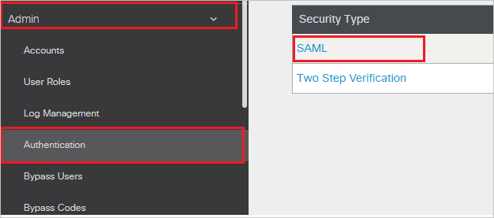
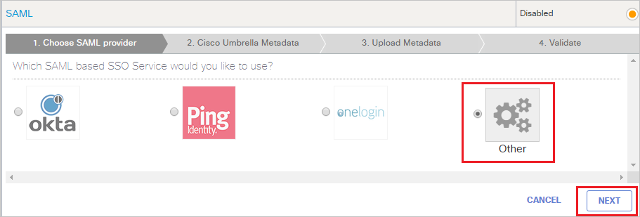
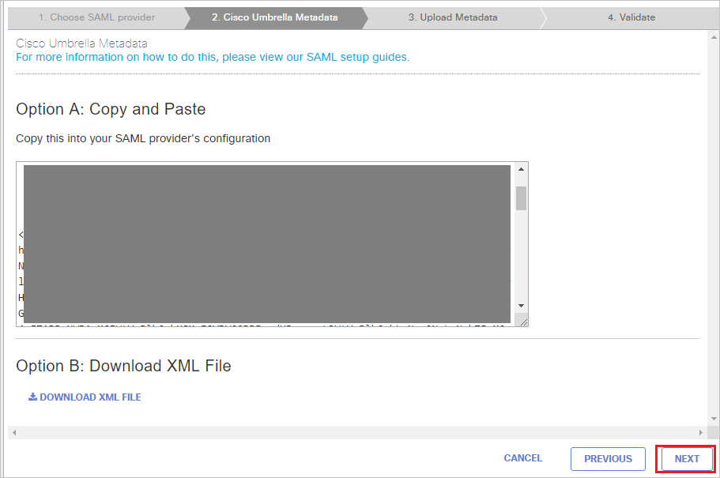
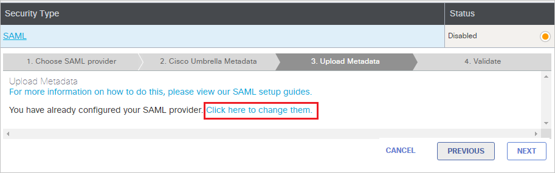
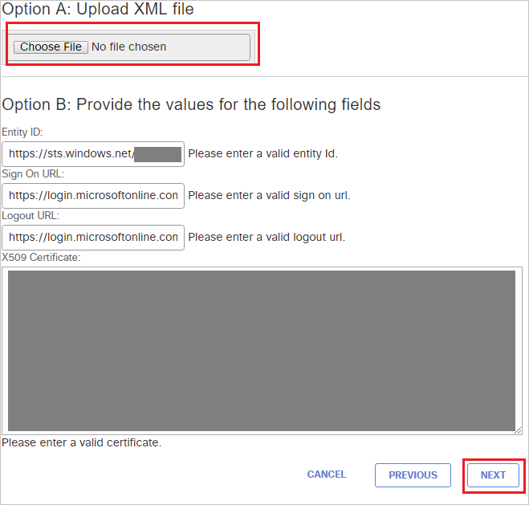
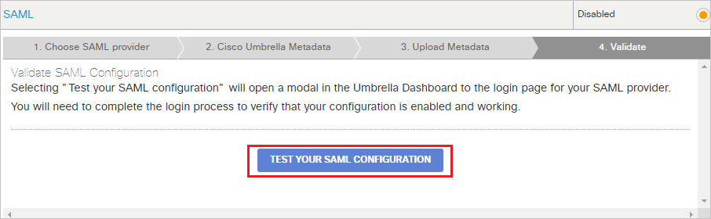

## Prerequisites

To configure Azure AD integration with Cisco Umbrella, you need the following items:

- An Azure AD subscription
- A Cisco Umbrella single sign-on enabled subscription

> **Note:**
> To test the steps in this tutorial, we do not recommend using a production environment.

To test the steps in this tutorial, you should follow these recommendations:

- Do not use your production environment, unless it is necessary.
- If you don't have an Azure AD trial environment, you can [get a one-month trial](https://azure.microsoft.com/pricing/free-trial/).

### Configuring Cisco Umbrella for single sign-on

1. In a different browser window, sign-on to your Cisco Umbrella company site as administrator.

2.  From the left side of menu, click **Admin** and navigate to **Authentication** and then click on **SAML**.

	

3. Choose **Other** and click on **NEXT**.

	

4. On the **Cisco Umbrella Metadata**, page, click **NEXT**.

	

5. On the **Upload Metadata** tab, if you had pre-configured SAML, select **Click here to change them** option and follow the below steps.

	

6. In the **Option A: Upload XML file**,  upload the **[Downloaded SAML Metadata file](%metadata:metadataDownloadUrl%)** from the Azure portal and after uploading metadata the below values get auto populated automatically then click **NEXT**.

	

7. Under **Validate SAML Configuration** section, click **TEST YOUR SAML CONFIGURATION**.

	

8. Click **SAVE**.

## Quick Reference

* **Azure AD Single Sign-On Service URL** : %metadata:singleSignOnServiceUrl%

* **[Download Azure AD Signing Certifcate](%metadata:CertificateDownloadRawUrl%)**

* **[Download SAML Metadata file](%metadata:metadataDownloadUrl%)**

## Additional Resources

* [How to integrate Cisco Umbrella with Azure Active Directory](https://docs.microsoft.com/azure/active-directory/saas-apps/cisco-umbrella-tutorial)
