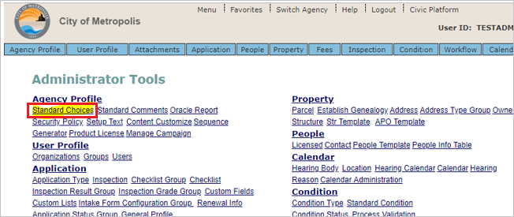
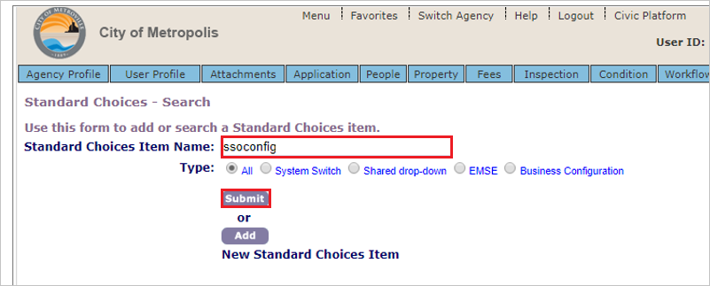
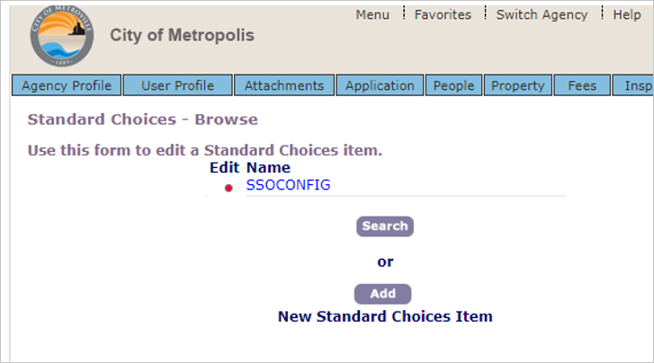
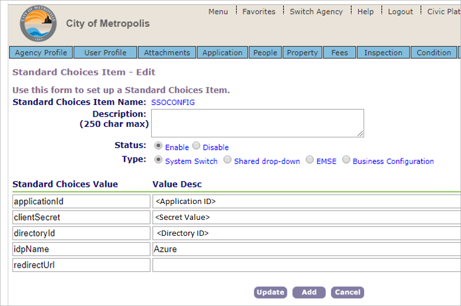

## Prerequisites

To configure Azure AD integration with Civic Platform, you need the following items:

- An Azure AD subscription
- A Civic Platform single sign-on enabled subscription

> **Note:**
> To test the steps in this tutorial, we do not recommend using a production environment.

To test the steps in this tutorial, you should follow these recommendations:

- Do not use your production environment, unless it is necessary.
- If you don't have an Azure AD trial environment, you can get a [free account](https://azure.microsoft.com/free/).

### Configuring Civic Platform for single sign-on

1. Open a new web browser window and sign into your Atlassian Cloud company site as an administrator.

1. Click on **Standard Choices**.

    

1. Create a standard choice **ssoconfig**.

1. Search for **ssoconfig**  and submit.

    

1. Expand SSOCONFIG by clicking on red dot.

    

1. Provide SSO related configuration information in the following step:

    

    1. In the **applicationid** field, enter the **Application ID** value, which you have copied from the Azure portal.

    1. In the **clientSecret** field, enter the **Secret** value, which you have copied from the Azure portal.

    1. In the **directoryId** field, enter the **Directory (tenant) ID** value, which you have copied from the Azure portal.

    1. Enter the idpName. Ex:- `Azure`.

## Quick Reference

* **Login URL** : %metadata:singleSignOnServiceUrl%

* **[Download Azure AD Signing Certifcate](%metadata:CertificateDownloadRawUrl%)**

* **[Download SAML Metadata file](%metadata:metadataDownloadUrl%)**

## Additional Resources

* [How to integrate Civic Platform with Azure Active Directory](https://docs.microsoft.com/azure/active-directory/saas-apps/civic-platform-tutorial)
