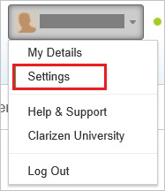
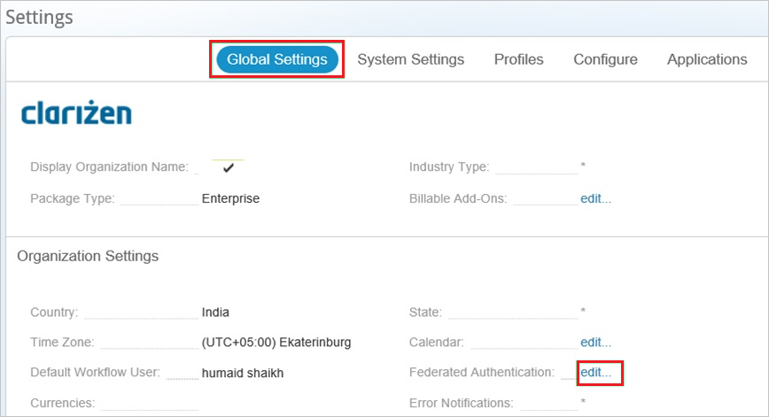
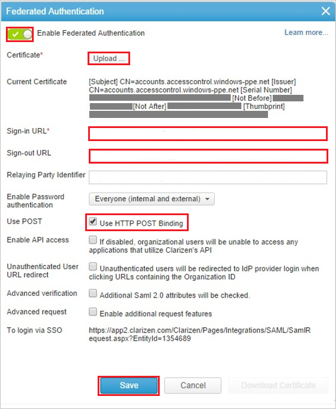

## Prerequisites

To configure Azure AD integration with Clarizen, you need the following items:

- An Azure AD subscription
- A Clarizen single sign-on enabled subscription

> **Note:**
> To test the steps in this tutorial, we do not recommend using a production environment.

To test the steps in this tutorial, you should follow these recommendations:

- Do not use your production environment, unless it is necessary.
- If you don't have an Azure AD trial environment, you can [get a one-month trial](https://azure.microsoft.com/pricing/free-trial/).

### Configuring Clarizen for single sign-on

1. In a different web browser window, sign in to your Clarizen company site as an administrator.

2. Click your username, and then click **Settings**.

	

3. Click the **Global Settings** tab. Then, next to **Federated Authentication**, click **edit**.

	

4. In the **Federated Authentication** dialog box, perform the following steps:

	

	a. Select **Enable Federated Authentication**.

	b. Click **Upload** to upload your **[Downloaded Azure AD Signing Certifcate (Base64 encoded)](%metadata:certificateDownloadBase64Url%)** downloaded from the Azure portal.

	c. Paste **Azure AD Single Sign-On Service URL** : %metadata:singleSignOnServiceUrl%, which you have copied from the Azure portal into the **Sign-in URL** textbox.

	d. Paste **Azure AD Sign Out URL** : %metadata:singleSignOutServiceUrl%, which you have copied from the Azure portal into the **Sign-Out URL** textbox. 
	
	e. Select **Use POST**.

	f. Click **Save**.

## Quick Reference

* **Azure AD Single Sign-On Service URL** : %metadata:singleSignOnServiceUrl%

* **Azure AD Sign Out URL** : %metadata:singleSignOutServiceUrl%

* **[Download Azure AD Signing Certifcate (Base64 encoded)](%metadata:certificateDownloadBase64Url%)**

## Additional Resources

* [How to integrate Clarizen with Azure Active Directory](https://docs.microsoft.com/azure/active-directory/active-directory-saas-clarizen-tutorial)
