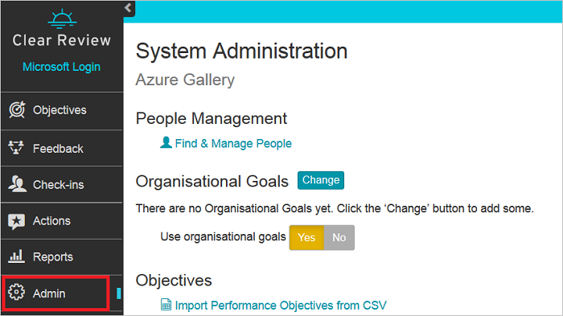
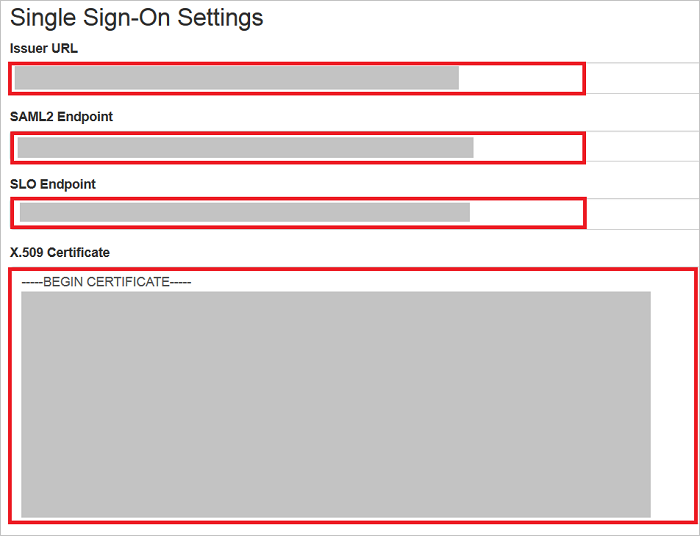

## Prerequisites

To configure Azure AD integration with Clear Review, you need the following items:

- An Azure AD subscription
- A Clear Review single sign-on enabled subscription

> **Note:**
> To test the steps in this tutorial, we do not recommend using a production environment.

To test the steps in this tutorial, you should follow these recommendations:

- Do not use your production environment, unless it is necessary.
- If you don't have an Azure AD trial environment, you can [get a one-month trial](https://azure.microsoft.com/pricing/free-trial/).

### Configuring Clear Review for single sign-on

1. To configure single sign-on on **Clear Review** side, open the **Clear Review** portal with admin credentials.

2. Select **Admin** from the left navigation.

	

3. Select **Change** at the bottom of the page.

	

4. Perform following steps on **Single Sign-On Settings** page

	

	a. In the **Issuer URL** textbox, paste the value of **Azure AD SAML Entity ID** : %metadata:IssuerUri% which you have copied from Azure portal.

	b. In the **SAML Endpoint** textbox, paste the value of **Azure AD Single Sign-On Service URL** : %metadata:singleSignOnServiceUrl% which you have copied from Azure portal.

	c. In the **SLO Endpoint** textbox, paste the value of **Azure AD Sign Out URL** : %metadata:singleSignOutServiceUrl% which you have copied from Azure portal.
	
	d. Open the **[Downloaded Azure AD Signing Certifcate](%metadata:CertificateDownloadRawUrl%)** in notepad and paste the content in the **X.509 Certificate** textbox.

5. Click **Save**.

## Quick Reference

* **Azure AD Single Sign-On Service URL** : %metadata:singleSignOnServiceUrl%

* **Azure AD Sign Out URL** : %metadata:singleSignOutServiceUrl%

* **Azure AD SAML Entity ID** : %metadata:IssuerUri%

* **[Download Azure AD Signing Certifcate](%metadata:CertificateDownloadRawUrl%)**

## Additional Resources

* [How to integrate Clear Review with Azure Active Directory](https://docs.microsoft.com/azure/active-directory/active-directory-saas-clearreview-tutorial)
