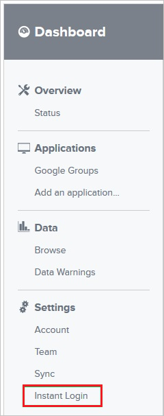
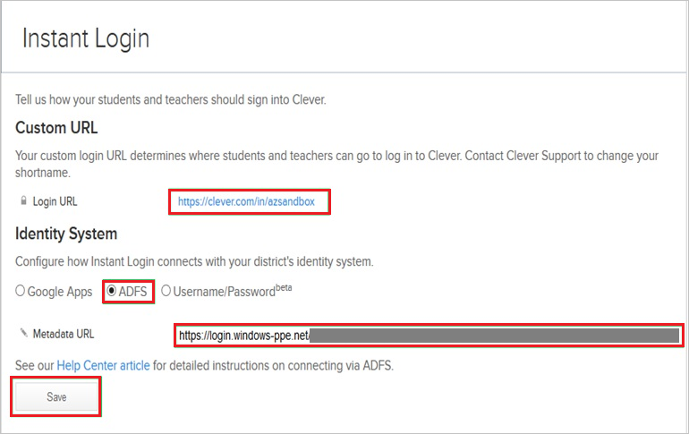

## Prerequisites

To configure Azure AD integration with Clever, you need the following items:

- An Azure AD subscription
- A Clever single-sign on enabled subscription

> **Note:**
> To test the steps in this tutorial, we do not recommend using a production environment.

To test the steps in this tutorial, you should follow these recommendations:

- Do not use your production environment, unless it is necessary.
- If you don't have an Azure AD trial environment, you can get a one-month trial [here](https://azure.microsoft.com/pricing/free-trial/).

### Configuring Clever for single sign-on

1. In a different web browser window, log in to your Clever company site as an administrator.

2. In the toolbar, click **Instant Login**.
   
   

3. On the **Instant Login** page, perform the following steps:
      
	  

	a. Type the **Login URL**.
	
	>[!NOTE]
	>The **Login URL** is a custom value. You can get the actual value from your [Clever Client support team](https://clever.com/about/contact/).

	b. As **Identity System**, select **ADFS**.

	c. Click **Save**.

## Quick Reference

* **[Download SAML Metadata file](%metadata:metadataDownloadUrl%)**

## Additional Resources

* [How to integrate Clever with Azure Active Directory](https://docs.microsoft.com/azure/active-directory/active-directory-saas-clever-tutorial)
