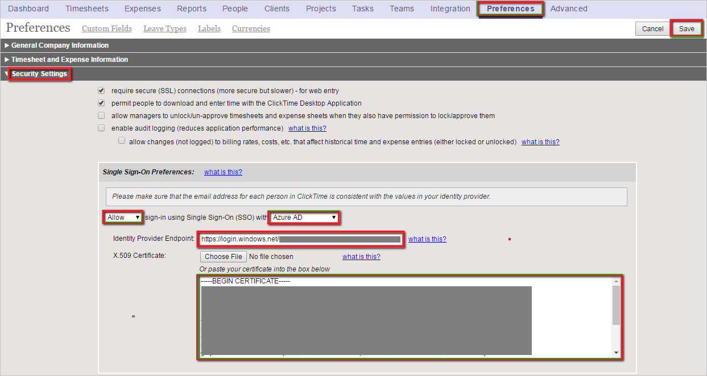

## Prerequisites

To configure Azure AD integration with ClickTime, you need the following items:

- An Azure AD subscription
- A ClickTime single sign-on enabled subscription

> **Note:**
> To test the steps in this tutorial, we do not recommend using a production environment.

To test the steps in this tutorial, you should follow these recommendations:

- Do not use your production environment, unless it is necessary.
- If you don't have an Azure AD trial environment, you can get a one-month trial [here](https://azure.microsoft.com/pricing/free-trial/).

### Configuring ClickTime for single sign-on

1. In a different web browser window, log into your ClickTime company site as an administrator.

2. In the toolbar on the top, click **Preferences**, and then click **Security Settings**.

3. In the **Single Sign-On Preferences** configuration section, perform the following steps:
   
    
   
    a.  Select **Allow** sign-in using Single Sign-On (SSO) with **Azure AD**.
   
    b. In the **Identity Provider Endpoint** textbox, enter **Azure AD Single Sign-On Service URL** : %metadata:singleSignOnServiceUrl%.
   
    c.  Open the **[base-64 encoded certificate](%metadata:certificateDownloadBase64Url%)** downloaded from Azure portal in **Notepad**, copy the content, and then paste it into the **X.509 Certificate** textbox.
   
    d.  Click **Save**.

## Quick Reference

* **Azure AD Single Sign-On Service URL** : %metadata:singleSignOnServiceUrl%

* **[Download Azure AD Signing Certifcate (Base64 encoded)](%metadata:certificateDownloadBase64Url%)**

## Additional Resources

* [How to integrate ClickTime with Azure Active Directory](https://docs.microsoft.com/azure/active-directory/active-directory-saas-clicktime-tutorial)
