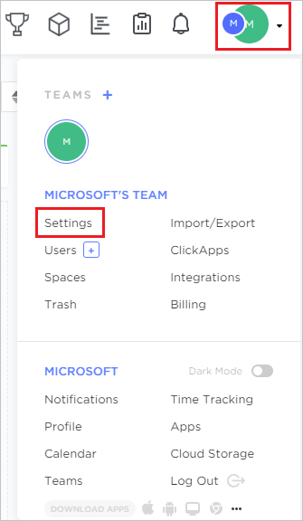
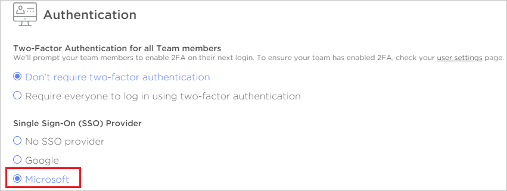
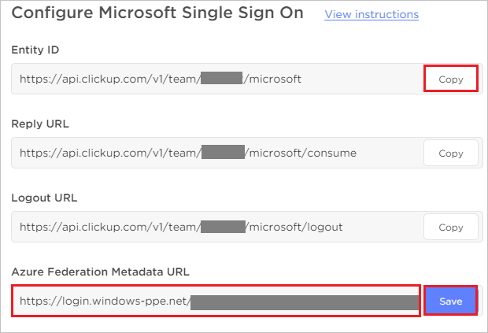

## Prerequisites

To configure Azure AD integration with ClickUp Productivity Platform, you need the following items:

- An Azure AD subscription
- A ClickUp Productivity Platform single sign-on enabled subscription

> **Note:**
> To test the steps in this tutorial, we do not recommend using a production environment.

To test the steps in this tutorial, you should follow these recommendations:

- Do not use your production environment, unless it is necessary.
- If you don't have an Azure AD trial environment, you can [get a one-month trial](https://azure.microsoft.com/pricing/free-trial/).

### Configuring ClickUp Productivity Platform for single sign-on

1. In a different web browser window, sign-on to your ClickUp Productivity Platform tenant as an administrator.

2. Click on the **User profile** and select **Settings**.

    

3. Select **Microsoft**, under Single Sign-On (SSO) Provider.

    

4. On the **Configure Microsoft Single Sign On** page, perform the following steps:

    

    a. Click **Copy** to copy the Entity ID value and paste it into the **Identifier (Entity ID)** textbox in the **Basic SAML Configuration** section in the Azure portal.

    b. In the **Azure Federation Metadata URL** textbox, paste the App Federation Metadata Url value, which you have copied from the Azure portal and then click **Save**.

5. To complete the setup, click **Authenticate With Microsoft to complete setup** and authenticate with microsoft account.

    

## Quick Reference

* **Azure AD Single Sign-On Service URL** : %metadata:singleSignOnServiceUrl%

* **[Download Azure AD Signing Certifcate](%metadata:CertificateDownloadRawUrl%)**

* **[Download SAML Metadata file](%metadata:metadataDownloadUrl%)**

## Additional Resources

* [How to integrate ClickUp Productivity Platform with Azure Active Directory](https://docs.microsoft.com/azure/active-directory/saas-apps/clickup-productivity-platform-tutorial)
