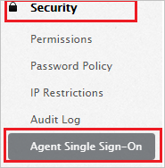

## Prerequisites

To configure Azure AD integration with Comm100 Live Chat, you need the following items:

- An Azure AD subscription
- A Comm100 Live Chat single sign-on enabled subscription

> **Note:**
> To test the steps in this tutorial, we do not recommend using a production environment.

To test the steps in this tutorial, you should follow these recommendations:

- Do not use your production environment, unless it is necessary.
- If you don't have an Azure AD trial environment, you can [get a one-month trial](https://azure.microsoft.com/pricing/free-trial/).

### Configuring Comm100 Live Chat for single sign-on

1. In a different web browser window, login to Comm100 Live Chat as a Security Administrator.

2. On the top right side of the page, click **My Account**.

	

3. From the left side of menu, click **Security** and then click **Agent Single Sign-On**.

	

4. On the **Agent Single Sign-On** page, perform the following steps:

	

	a. Copy the first highlighted link and paste it in **Sign-on URL** textbox in **Comm100 Live Chat Domain and URLs** section on Azure portal.

	b. In the **SAML SSO URL** textbox, paste the value of **Azure AD Single Sign-On Service URL** : %metadata:singleSignOnServiceUrl%, which you have copied from the Azure portal.

	c. In the **Remote Logout URL** textbox, paste the value of **Azure AD Sign Out URL** : %metadata:singleSignOutServiceUrl%, which you have copied from the Azure portal.

	d. Click **Choose a File** to upload the **[Downloaded Azure AD Signing Certifcate (Base64 encoded)](%metadata:certificateDownloadBase64Url%)** from the Azure portal, into the **Certificate**.

	e. Click **Save Changes**

## Quick Reference

* **Azure AD Single Sign-On Service URL** : %metadata:singleSignOnServiceUrl%

* **Azure AD Sign Out URL** : %metadata:singleSignOutServiceUrl%

* **Azure AD SAML Entity ID** : %metadata:IssuerUri%

* **[Download Azure AD Signing Certifcate (Base64 encoded)](%metadata:certificateDownloadBase64Url%)**

## Additional Resources

* [How to integrate Comm100 Live Chat with Azure Active Directory](https://docs.microsoft.com/azure/active-directory/saas-apps/comm100livechat-tutorial)
